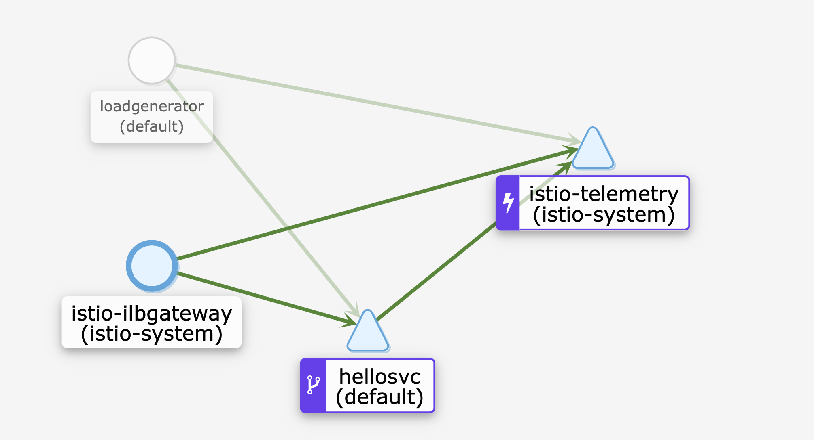

# Demo: Using a GCP Internal Load Balancer with Istio

This demo shows how to use an Internal Load Balancer (ILB) to connect Istio workloads running in Google Kubernetes Engine (GKE) with VM-based workloads in Google Compute Engine (GCE).

**Note**: [ILB for GKE](https://cloud.google.com/kubernetes-engine/docs/how-to/internal-load-balancing) is currently in beta.

## How It Works

An [Internal Load Balancer (ILB)](https://cloud.google.com/load-balancing/docs/internal/) is a Google Cloud Platform (GCP) resource that exposes workloads (in GCE or GKE) to other workloads within the same region, and the same [Virtual Private Cloud](https://cloud.google.com/vpc/) (VPC) network. Using an ILB replaces the need to use a GKE external load balancer with a set of firewall rules.

You can [annotate Kubernetes Services](https://cloud.google.com/kubernetes-engine/docs/how-to/internal-load-balancing#overview) directly to provision a GCP ILB, instead of an external network load balancer. However, Istio has its own [ILB Gateway](https://istio.io/docs/reference/config/installation-options/#gateways-options) for exposing Services inside the mesh.

The value of using the Istio ILB Gateway is that it's highly configurable -- you can, for instance, [define granular traffic rules](https://istio.io/docs/tasks/traffic-management/ingress/) to be applied for a specific service exposed via that ILB Gateway. Using an ILB Gateway replaces the need to use an external `Service type=LoadBalancer` with a set of firewall rules.

If Istio's ILB Gateway is enabled on install, it is annotated to provision its own ILB inside your GCP project. Note that a GCP Internal Load Balancer [is not a proxy](https://cloud.google.com/load-balancing/docs/internal/#how_ilb_works), but rather a resource that configures GCE instances directly to talk to "backends" within the same VPC network. In this case, the "backend" of the Istio ILB load balancer will be a GKE Instance Group — or, the set of VMs that comprise the GKE cluster.

In this demo, we will build the following architecture:


## Prerequisites

- A GCP project with billing enabled
- [Helm](https://helm.sh/docs/using_helm/#installing-helm) (CLI) installed on your local machine

## 1 - Create a GKE Cluster

1. **Export project ID:**

```
PROJECT_ID=<your-project-id>
```

2. **Create the cluster:**

```
gcloud container clusters create istio-ilb --project $PROJECT_ID --zone us-east4-a \
--machine-type "n1-standard-2" --image-type "COS" --disk-size "100" \
--num-nodes "4" --network "default" --async
```

Wait for the cluster to be `RUNNING`, by executing:

```
gcloud container clusters list --project $PROJECT_ID

```

3. **Get credentials,** then grant RBAC permissions for Istio.

```
gcloud container clusters get-credentials istio-ilb --zone us-east4-a --project $PROJECT_ID

kubectl create clusterrolebinding cluster-admin-binding \
--clusterrole=cluster-admin \
--user=$(gcloud config get-value core/account)
```

## 2 - Install Istio with ILB Gateway Enabled


1. **Download Istio:**

Set [Istio version](https://github.com/istio/istio/releases):

```
ISTIO_VERSION=<version>
```

Download Istio:

```
curl -L https://git.io/getLatestIstio | ISTIO_VERSION=${ISTIO_VERSION} sh -
```

2. **Prepare the cluster for install:**

```
kubectl create namespace istio-system
kubectl label namespace default istio-injection=enabled
helm template istio-${ISTIO_VERSION}/install/kubernetes/helm/istio-init --name istio-init --namespace istio-system | kubectl apply -f -
```

3. **Wait for CRDs to be ready:**

```
kubectl get crds | grep 'istio.io\|certmanager.k8s.io' | wc -l
```

The output of this command should be either `53` (Istio 1.1) or `23` (Istio 1.2).

4. **Generate the Istio installation YAML.**

(Note that we're enabling the option to deploy the ILB Gateway.)
```
helm template ./istio-${ISTIO_VERSION}/install/kubernetes/helm/istio --name istio --namespace istio-system \
   --set prometheus.enabled=true \
   --set kiali.enabled=true --set kiali.createDemoSecret=true \
   --set "kiali.dashboard.jaegerURL=http://jaeger-query:16686" \
   --set "kiali.dashboard.grafanaURL=http://grafana:3000" \
   --set grafana.enabled=true \
   --set sidecarInjectorWebhook.enabled=true \
   --set gateways.istio-ilbgateway.enabled=true > istio.yaml
```

*Optional* - Open `istio.yaml` and search the file for `istio-ilbgateway`. You will find a Kubernetes Service, `istio-ilbgateway`, that is Service `type=LoadBalancer`, but has the annotation: `cloud.google.com/load-balancer-type: "internal"`. This means that rather than provisioning an external [Network Load Balancer](https://cloud.google.com/load-balancing/docs/network/) for Istio's ILB gateway, GKE will create an [Internal Load Balancer](https://cloud.google.com/load-balancing/docs/internal/) instead. [See the GCP docs](https://cloud.google.com/kubernetes-engine/docs/how-to/internal-load-balancing#create) for more information.

Also note that the Istio ILB Gateway has [more customization options](https://istio.io/docs/reference/config/installation-options/#gateways-options) on install that we aren't using here, that would be useful for production use cases-- for example, autoscaling options, and memory/CPU allocations.

5. **Install Istio on the cluster:**
```
kubectl apply -f istio.yaml
```

Run `kubectl get pods -n istio-system`. Notice a pod with the name prefix `istio-ilbgateway`. This is the Envoy proxy that will handle our requests from GCE.

## 3 - Deploy the HelloServer application

HelloServer is a Python HTTP server that serves the `GET / ` endpoint, and prints `HelloWorld`. We'll also deploy a load generator (also Python) that will repeatedly send 10 Requests per Second (RPS) to `helloserver`.

```
kubectl apply -f ../sample-apps/helloserver/server/server.yaml

kubectl apply -f ../sample-apps/helloserver/loadgen/loadgen.yaml
```

## 4 - Open the Kiali Dashboard

[Kiali](https://www.kiali.io/) is a web-based Istio dashboard for observing your Istio mesh topology. We installed Kiali already, with the rest of the Istio control plane.

1. **Port-forward Kiali to your local machine**

```
kubectl -n istio-system port-forward $(kubectl -n istio-system get pod -l app=kiali -o jsonpath='{.items[0].metadata.name}') 20001:20001
```

2. **Open the Kiali dashboard in a browser**

Navigate to http://localhost:20001/kiali. Then, log in with the demo credentials: `admin/admin`.

Then, navigate in the left sidebar to `Graph`, and view the Service Graph for the `default` Kubernetes namespace. This is the namespace into which we've deployed the `helloserver` application.


## 5- Modify ILB Gateway's Ports

Now imagine that we want to reach HelloService from a workload not in the Istio mesh, and from outside of GKE.

Right now, HelloServer is not exposed to the Internet. We only have a `ClusterIP` service which only exposes HelloServer within the cluster, thus allowing the `loadgen` pod to reach it via kubedns (`hellosvc:80`).

One route to connect GCE to Istio on GKE is through [Mesh Expansion](https://github.com/GoogleCloudPlatform/istio-samples/tree/master/mesh-expansion-gce). This installs Istio components on the VM itself, and logically and functionally brings the GCE instance into the service mesh. But if (for administrative, complexity, or other reasons) we want to keep the GCE VM out of the mesh, but also not expose HelloSvc to the public internet, we can use the ILB Gateway to connect the GCP infrastructure.

1. **Return to the command line, and run:**

```
kubectl get svc -n istio-system istio-ilbgateway -o yaml
```

Notice that under the `ports` field, there are four ports defined, all for internal Istio purposes. Neither port `80` nor `443` (for HTTP/S) are exposed by default. So let's modify the ILB Gateway to additionally accept HTTP traffic on port 80.

2. **Add port 80 to the ILB gateway service**

```
kubectl apply -f istio/ilb-gateway-modified.yaml
```

**Note** - There is [a limitation of 5 ports](https://cloud.google.com/load-balancing/docs/internal/#forwarding_rule) for a GCP Internal Load Balancer. Outside of Kubernetes, there is an option to enable `all` ports, but you must provide a specific list of ports to expose for a Kubernetes service.


## 6 - Create a GCE Instance

Now, we'll create a GCE Instance in the same project. **Note**: we will create this VM in the same region as the GKE cluster. This is a prerequisite for GCP resource communication via ILB. Also notice that `--network=default` means we're creating the GCE VM in the same VPC network as the GKE cluster, which is also using the `default` network.

```
gcloud compute --project=$PROJECT_ID instances create gce-ilb --zone=us-east4-a --machine-type=n1-standard-2 --network=default
```


## 7 - Expose HelloServer via the ILB Gateway

If we want to send traffic from GCE to GKE, via the Istio ILB Gateway, we will have to expose HelloServer within GCP. This will be the same process as if we were exposing HelloServer to the public internet ([with the IngressGateway](https://istio.io/docs/tasks/traffic-management/ingress/#configuring-ingress-using-an-istio-gateway)). For this, we'll use an Istio `Gateway` resource, along with a `VirtualService`.

```
kubectl apply -f istio/server-ilb.yaml
```


## 8 - Send Traffic from GCE to GKE via ILB Gateway

Because the Istio ILBGateway service is `type=LoadBalancer`, it gets an `EXTERNAL_IP`, but only "external" within our regional VPC network:

1. **Get the EXTERNAL_IP for istio-ilbgateway:**
```
kubectl get svc -n istio-system istio-ilbgateway
```

You should see something like:

```
NAME               TYPE           CLUSTER-IP      EXTERNAL-IP   PORT(S)                                                                      AGE
istio-ilbgateway   LoadBalancer   10.67.240.220   10.150.0.7    15011:32390/TCP,15010:32626/TCP,8060:32429/TCP,5353:32066/TCP,80:32624/TCP   39m
```

Copy the `EXTERNAL_IP` to the clipboard.

2. **ssh into the GCE instance:**

```
gcloud compute ssh --project $PROJECT_ID  --zone "us-east4-a" gce-ilb
```

3. **Reach helloserver via the ILB gateway IP, at port 80:**

```
curl http://<EXTERNAL_IP>:80
```

You should see:

```
Hello World! /
```

This request just went from your GCE instance, to the Istio ILB Gateway, then to the `helloserver` Service inside the Istio mesh.

Notice that if you try to execute the same `curl` request on your local machine, you will time out -- this because the ILB Gateway is only exposed from within your GCP project's private VPC network.

## 9 - Observe changes to the service graph

Re-open the Kiali service graph in the browser -- now notice how the ilb-gateway is also now serving traffic for `helloserver`.




🌟 **Well done** - you just exposed a GKE service via Istio's ILB Gateway!


## Cleanup

1. **Delete the GCE VM**:

```
gcloud compute --project=$PROJECT_ID instances delete gce-ilb --zone=us-east4-a
```

2. **Delete the GKE Cluster**:

```
gcloud container clusters delete istio-ilb --project $PROJECT_ID --zone us-east4-a
```