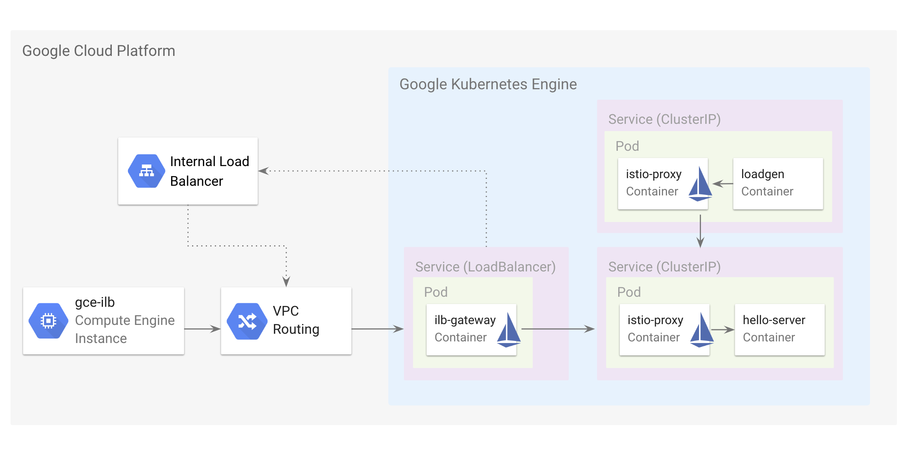
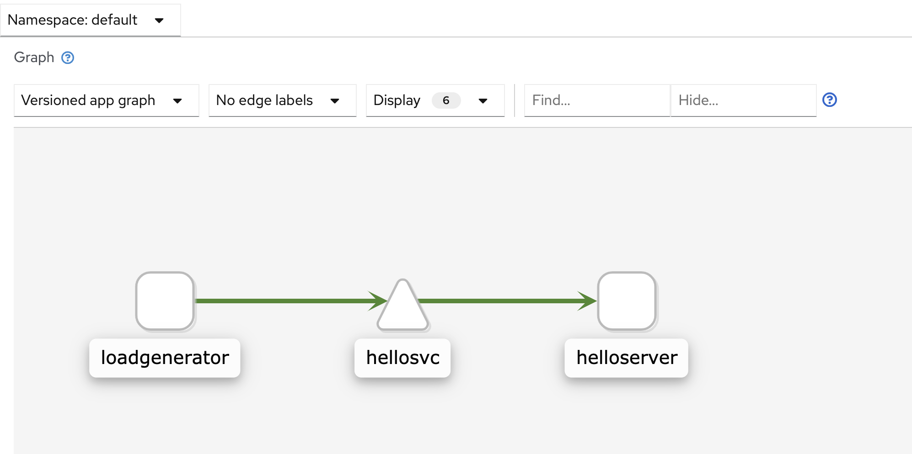

# Demo: Using a GCP Internal Load Balancer with Istio

This demo shows how to use an Internal Load Balancer (ILB) to connect Istio workloads running in Google Kubernetes Engine (GKE) with VM-based workloads in Google Compute Engine (GCE).

**Note**: [ILB for GKE](https://cloud.google.com/kubernetes-engine/docs/how-to/internal-load-balancing) is currently in beta.

## How It Works

An [Internal Load Balancer (ILB)](https://cloud.google.com/load-balancing/docs/internal/) is a Google Cloud Platform (GCP) resource that exposes workloads (in GCE or GKE) to other workloads within the same region, and the same [Virtual Private Cloud](https://cloud.google.com/vpc/) (VPC) network. Using an ILB replaces the need to use a GKE external load balancer with a set of firewall rules.

You can [annotate Kubernetes Services](https://cloud.google.com/kubernetes-engine/docs/how-to/internal-load-balancing#overview) directly to provision a GCP ILB, instead of an external network load balancer. However, Istio has its own [ILB Gateway](https://istio.io/docs/reference/config/installation-options/#gateways-options) for exposing Services inside the mesh.

The value of using the Istio ILB Gateway is that it's highly configurable -- you can, for instance, [define granular traffic rules](https://istio.io/docs/tasks/traffic-management/ingress/) to be applied for a specific service exposed via that ILB Gateway. Using an ILB Gateway replaces the need to use an external `Service type=LoadBalancer` with a set of firewall rules.

If Istio's ILB Gateway is enabled on install, it is annotated to provision its own ILB inside your GCP project. Note that a GCP Internal Load Balancer [is not a proxy](https://cloud.google.com/load-balancing/docs/internal/#how_ilb_works), but rather a resource that configures GCE instances directly to talk to "backends" within the same VPC network. In this case, the "backend" of the Istio ILB load balancer will be a GKE Instance Group — or, the set of VMs that comprise the GKE cluster.

In this demo, we will build the following architecture:



## Prerequisites

- A GCP project with billing enabled
- [Helm](https://helm.sh/docs/using_helm/#installing-helm) (CLI) installed on your local machine

## Create a GKE Cluster

1. **Export project ID:**

```
PROJECT_ID=<your-project-id>
```

2. **Create the cluster:**

```
gcloud container clusters create istio-ilb --project $PROJECT_ID --zone us-central1-c \
--machine-type "n1-standard-2" --image-type "COS" --disk-size "100" \
--num-nodes "4" --network "default" --async
```

3. Wait for the cluster to be `RUNNING`, by executing:

```
gcloud container clusters list --project $PROJECT_ID
```

4. Get credentials:

```
gcloud container clusters get-credentials istio-ilb --zone us-central1-c --project $PROJECT_ID
```

## Install Istio with ILB Gateway Enabled

1. Open the install profile in `manifests/install.yaml`. This is a default install profile with the ILB ingress gateway enabled in addition to the default, publicly-accessible `istio-ingressgateway`. Notice line 104:

```
      k8s:
        serviceAnnotations:
          cloud.google.com/load-balancer-type: "internal"
```

Here, instead of provisioning this second Istio gateway with a public load balancer, we are telling GKE to instead provision an internal [GCP internal load balancer](https://cloud.google.com/load-balancing/docs/internal). This means that this gateway will only be accessible from inside the GCP virtual private cloud (VPC) - for instance, from a Google Compute Engine instance in the same GCP project.

2. Install Istio on the cluster. Clone this repository and navigate to the root `istio-samples` directory. Then, apply the install profile:

```
cd common/
INSTALL_YAML="../internal-load-balancer/manifests/install.yaml" ./install_istio.sh
```

3. Run `kubectl get pods -n istio-system`. You should see two gateway pods running: `istio-ilbgateway` and `istio-ingressgateway`.

```
NAME                                    READY   STATUS    RESTARTS
 AGE
grafana-556b649566-s2bj2                1/1     Running   0
 39s
istio-ilbgateway-7fb4b47dcc-x7zbc       1/1     Running   0
 43s
istio-ingressgateway-598796f4d9-gszfx   1/1     Running   0
 43s
istio-tracing-7cf5f46848-g47zt          1/1     Running   0
 39s
istiod-55fb557b7-ltfxj                  1/1     Running   0
 58s
kiali-6d54b8ccbc-v26ds                  1/1     Running   0
 39s
prometheus-5bd4c4679b-dbvsn             2/2     Running   0
 38s
```

4. Get the Kubernetes services corresponding to the two Istio Gateways. You should see two gateway services, both with an `EXTERNAL_IP` field. The `istio-ilbgateway` external IP is only "external" to its own VPC. **Note** - it may take several minutes to for the external IP to appear - in the meantime, you will see `<pending>` while the load balancers are provisioned.

```
$ kubectl get service -n istio-system | grep gateway

istio-ilbgateway            LoadBalancer   10.0.5.3      10.128.0.9      15011:30940/TCP,15010:32052/TCP,8060:32219/TCP,5353:30527/TCP,80:30694/TCP                                                   19m
istio-ingressgateway        LoadBalancer   10.0.2.236    34.70.166.247   15020:30267/TCP,80:32184/TCP,443:30578/TCP,15029:32296/TCP,15030:31735/TCP,15031:32750/TCP,15032:32506/TCP,15443:30743/TCP   19m
```


## Deploy the HelloServer application

HelloServer is a Python HTTP server that serves the `GET / ` endpoint, and prints `HelloWorld`. We'll also deploy a load generator (also Python) that will repeatedly send 10 Requests per Second (RPS) to `helloserver`.

```
cd ../internal-load-balancer/
kubectl apply -f ../sample-apps/helloserver/server/server.yaml
kubectl apply -f ../sample-apps/helloserver/loadgen/loadgen.yaml
```

## Explore the Kiali Dashboard

[Kiali](https://www.kiali.io/) is a web-based Istio dashboard for observing your Istio mesh topology. We installed Kiali already, with the rest of the Istio control plane.

1. Open the Kiali dashboard in a browser.

```
alias istioctl="../common/istio-1.5.2/bin/istioctl"
istioctl dashboard kiali &
```


2. Log in with the demo credentials: `admin/admin`.

3. navigate in the left sidebar to `Graph`, and view the Service Graph for the `default` Kubernetes namespace. This is the namespace into which we've deployed the `helloserver` application.



## Access HelloServer via ILB

Now that we can confirm that in-cluster workloads (like `loadgenerator`) can access `helloserver`, let's access `helloserver` from outside the GKE cluster, via the ILB gateway.

To do this, we'll create a GCE Instance in the same project / VPC. **Note**: we will create this VM in the same region as the GKE cluster. This is a prerequisite for GCP resource communication via ILB. Also notice that `--network=default` means we're creating the GCE VM in the same VPC network as the GKE cluster, which is also using the `default` network.

1. **Create a GCE instance.**

```
gcloud compute --project=$PROJECT_ID instances create gce-ilb --zone=us-central1-c --machine-type=n1-standard-2 --network=default
```


2. **Create a VirtualService and Gateway.**

If we want to send traffic from GCE to GKE, via the Istio ILB Gateway, we will have to expose HelloServer within GCP. This will be the same process as if we were exposing HelloServer to the public internet ([with the IngressGateway](https://istio.io/docs/tasks/traffic-management/ingress/#configuring-ingress-using-an-istio-gateway)). For this, we'll use an Istio `Gateway` resource, along with a `VirtualService`.

```
kubectl apply -f manifests/server-ilb.yaml
```

Because the Istio ILBGateway service is `type=LoadBalancer`, it gets an `EXTERNAL_IP`, but only "external" within our regional VPC network:

3. **Get the EXTERNAL_IP for istio-ilbgateway:**
```
kubectl get svc -n istio-system istio-ilbgateway
```

You should see something like:

```
NAME               TYPE           CLUSTER-IP      EXTERNAL-IP   PORT(S)                                                                      AGE
istio-ilbgateway   LoadBalancer   10.67.240.220   10.150.0.7    15011:32390/TCP,15010:32626/TCP,8060:32429/TCP,5353:32066/TCP,80:32624/TCP   39m
```

Copy the `EXTERNAL_IP` to the clipboard.

4. **ssh into the GCE instance:**

```
gcloud compute ssh --project $PROJECT_ID  --zone "us-central1-c" gce-ilb
```

5. **Reach helloserver via the ILB gateway IP, at port 80:**

```
export EXTERNAL_IP="<your-external-ip"

curl http://${EXTERNAL_IP}:80
```

You should see:

```
Hello World! /
```

This request just went from your GCE instance, to the Istio ILB Gateway, then to the `hellosvc` Service inside the Istio mesh.

Notice that if you try to execute the same `curl` request on your local machine, you will time out -- this because the ILB Gateway is only exposed from within your GCP project's private VPC network.

Finally, re-open the Kiali service graph in the browser -- now notice how the ilb-gateway is also now serving traffic for `hellosvc`.


🌟 **Well done** - you just exposed a GKE service via Istio's ILB Gateway!


## Cleanup

1. **Delete the GCE VM**:

```
gcloud compute --project=$PROJECT_ID instances delete gce-ilb --zone=us-central1-c --async
```

2. **Delete the GKE Cluster**:

```
gcloud container clusters delete istio-ilb --project $PROJECT_ID --zone us-central1-c --async
```