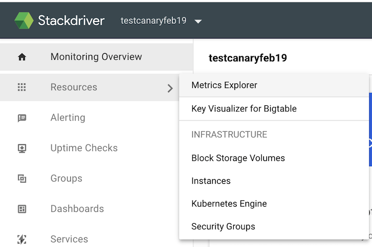
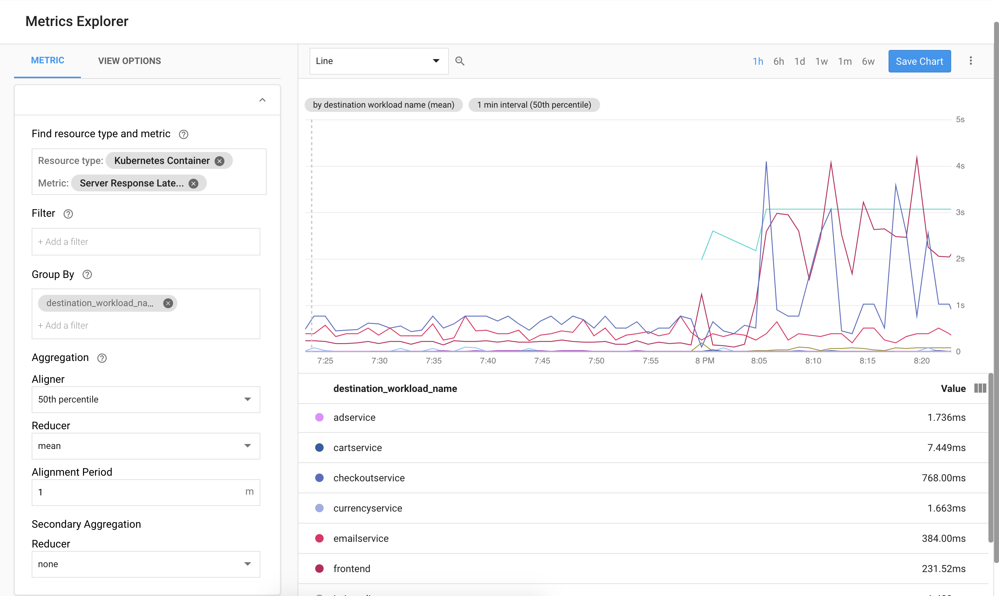
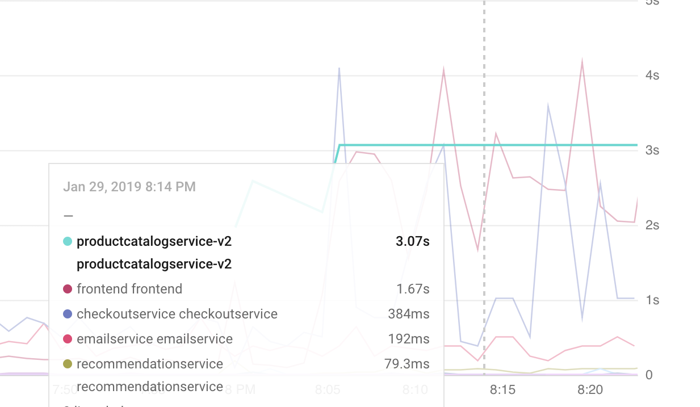

# ProductCatalog Canary Deployment (GKE / Istio)

This demo accompanies [a GCP Blog Post](https://cloud.google.com/blog/products/networking/advanced-application-deployments-and-traffic-management-with-istio-on-gke) on managing application deployments with Istio and
Stackdriver.

## Introduction

In this example, we will learn how to use [Istio’s](https://istio.io/) [Traffic Splitting](https://istio.io/docs/concepts/traffic-management/#splitting-traffic-between-versions) feature to perform a Canary deployment on [Google Kubernetes Engine](https://cloud.google.com/kubernetes-engine/).

In this sample, `productcatalogservice-v2` introduces a 3-second
[latency](https://github.com/GoogleCloudPlatform/microservices-demo/tree/master/src/productcatalogservice#latency-injection) into all server requests. We’ll show how to use Stackdriver and Istio together to
view the latency difference between the existing `productcatalog` deployment and the
slower v2 deployment.

  - [Setup](#setup)
  - [Deploy the Sample App](#deploy-the-sample-app)
  - [Deploy ProductCatalog v2](#deploy-productcatalog-v2)
  - [Observe Latency with Stackdriver](#observe-latency-with-stackdriver)
  - [Rollback](#rollback)
  - [Cleanup](#cleanup)
  - [Learn More](#learn-more)

## Setup

[Google Cloud Shell](https://cloud.google.com/shell/docs/) is a browser-based terminal that Google provides to interact with your GCP resources. It is backed by a free Compute Engine instance that comes with many useful tools already installed, including everything required to run this demo.

Click the button below to open the demo instructions in your Cloud Shell:

[](https://console.cloud.google.com/cloudshell/open?git_repo=https%3A%2F%2Fgithub.com%2FGoogleCloudPlatform%2Fistio-samples&page=editor&tutorial=istio-canary-gke/README.md)


## Create a GKE Cluster

1. From Cloud Shell, enable the Kubernetes Engine API.

```
gcloud services enable container.googleapis.com
```

2. Create a GKE cluster:

```
gcloud beta container clusters create istio-canary \
    --zone=us-central1-f \
    --machine-type=n1-standard-2 \
    --num-nodes=4
```

3. `cd` into the directory for this demo.
```
cd istio-canary-gke;
```

4. Install Istio on the cluster:

```
chmod +x ../common/install_istio.sh; ../common/install_istio.sh
```

5. Once the cluster is ready, ensure that Istio is running:

```
$ kubectl get pods -n istio-system

NAME                                     READY     STATUS      RESTARTS   AGE
istio-citadel-776fb85794-9gcqz           1/1       Running     0          7m
istio-cleanup-secrets-cg9b4              0/1       Completed   0          7m
istio-egressgateway-7f778c7fcf-hj9fw     1/1       Running     0          7m
istio-galley-794f98cf5f-9867s            1/1       Running     0          7m
istio-ingressgateway-56b648f9fb-mt7tb    1/1       Running     0          7m
istio-pilot-d87948784-7kfzt              2/2       Running     0          7m
istio-policy-5757c77d8f-54vsl            2/2       Running     0          7m
istio-security-post-install-bqjqq        0/1       Completed   0          7m
istio-sidecar-injector-f555db659-l5btv   1/1       Running     0          7m
istio-telemetry-85c84d85c6-qdtnm         2/2       Running     0          7m
prometheus-7c589d4989-9mgg8              2/2       Running     1          7m
```

## Deploy the Sample App

1. Deploy the [microservices-demo](https://github.com/GoogleCloudPlatform/microservices-demo) application, and add a `version=v1` label to the `productcatalog` deployment

```
kubectl apply -f https://raw.githubusercontent.com/GoogleCloudPlatform/microservices-demo/master/release/kubernetes-manifests.yaml
kubectl apply -f https://raw.githubusercontent.com/GoogleCloudPlatform/microservices-demo/master/release/istio-manifests.yaml
kubectl patch deployments/productcatalogservice -p '{"spec":{"template":{"metadata":{"labels":{"version":"v1"}}}}}'
```

2. Using `kubectl get pods`, verify that all pods are `Running` and `Ready`.

At this point, ProductCatalog v1 is deployed to the cluster, along with the rest of the
demo microservices. You can reach the Hipstershop frontend at the `EXTERNAL_IP` address
output for this command:

```
kubectl get svc -n istio-system istio-ingressgateway
```

## Deploy ProductCatalog v2

1. Create an Istio [DestinationRule](https://istio.io/docs/reference/config/istio.networking.v1alpha3/#DestinationRule) for `productcatalogservice`.

```
kubectl apply -f canary/destinationrule.yaml
```

2. Deploy `productcatalog` v2.
```
kubectl apply -f canary/productcatalog-v2.yaml
```

3. Using `kubectl get pods`, verify that the `v2` pod is Running.
```
productcatalogservice-v2-79459dfdff-6qdh4   2/2       Running   0          1m
```

4. Create an Istio [VirtualService](https://istio.io/docs/reference/config/istio.networking.v1alpha3/#VirtualService) to split incoming `productcatalog` traffic between v1 (75%) and v2 (25%).
```
kubectl apply -f canary/vs-split-traffic.yaml
```

5. In a web browser, navigate again to the hipstershop frontend.
6. Refresh the homepage a few times. You should notice that periodically, the frontend is
   slower to load. Let's explore ProductCatalog's latency with Stackdriver.

## Observe Latency with Stackdriver

1. Navigate to [Stackdriver Monitoring](https://app.google.stackdriver.com).
2. Create a Stackdriver Workspace for your GCP project
   ([instructions](https://cloud.google.com/monitoring/workspaces/guide#single-project-ws)).
3. From your new Stackdriver Workspace, navigate to **Resources > Metrics Explorer.** in the
   left sidebar.




4. From Metrics Explorer, enter the following parameters on the left side of the window:
	- **Resource type**: Kubernetes Container
	- **Metric**: Server Response Latencies (`istio.io/service/server/response_latencies`)
	- **Group by**: `destination_workload_name`
	- **Aggregator**: 50th percentile

5. In the menubar of the chart on the right, choose the **Line** type.
6. Once the latency chart renders, you should see `productcatalog-v2` as an outlier, with
    mean latencies hovering at 3 seconds. This is the value of `EXTRA_LATENCY` we injected into v2.



You’ll also notice that other services (such as `frontend`) have an irregular latency spike. This is because the [frontend relies on](https://github.com/GoogleCloudPlatform/microservices-demo#service-architecture) ProductCatalog, for which 25% of requests are routing through the slower `v2` deployment.



## Rollback

1. Return 100% of `productcatalog` traffic to `v1`:
```
kubectl apply -f canary/rollback.yaml
```
2. Finally, remove `v2`:
```
kubectl delete -f canary/productcatalog-v2.yaml
```

## Cleanup

To avoid incurring additional billing costs, delete the GKE cluster.

```
gcloud container clusters delete istio-canary --zone us-central1-f
```

## Learn More

- [Incremental Istio Part 1, Traffic
  Management](https://istio.io/blog/2018/incremental-traffic-management/) (Istio blog)
- [Canary Deployments using Istio](https://istio.io/blog/2017/0.1-canary/)  (Istio blog)
- [Drilling down into Stackdriver Service
  Monitoring](https://cloud.google.com/blog/products/gcp/drilling-down-into-stackdriver-service-monitoring)
  (GCP blog)
