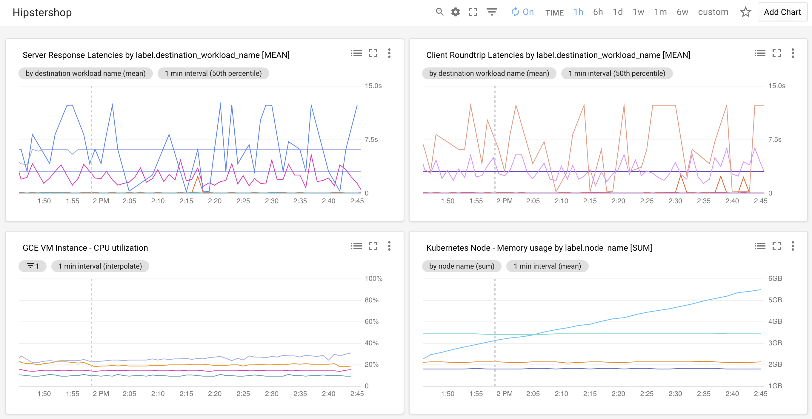
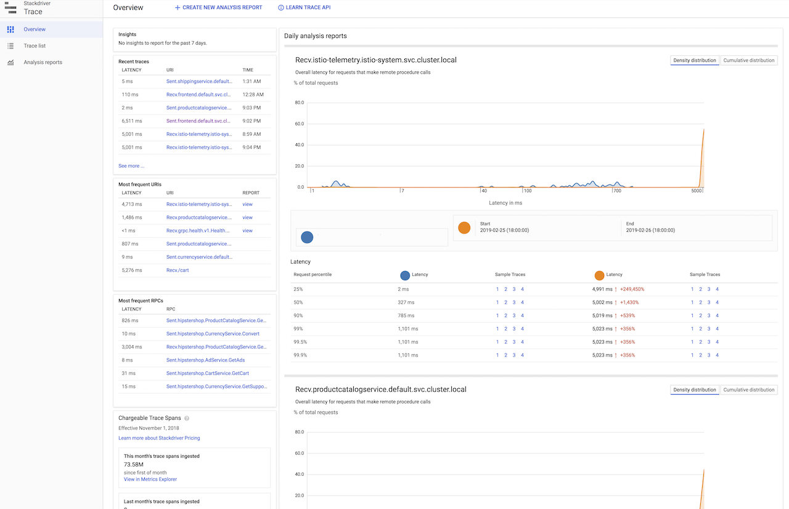
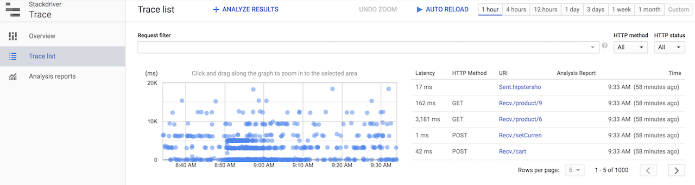
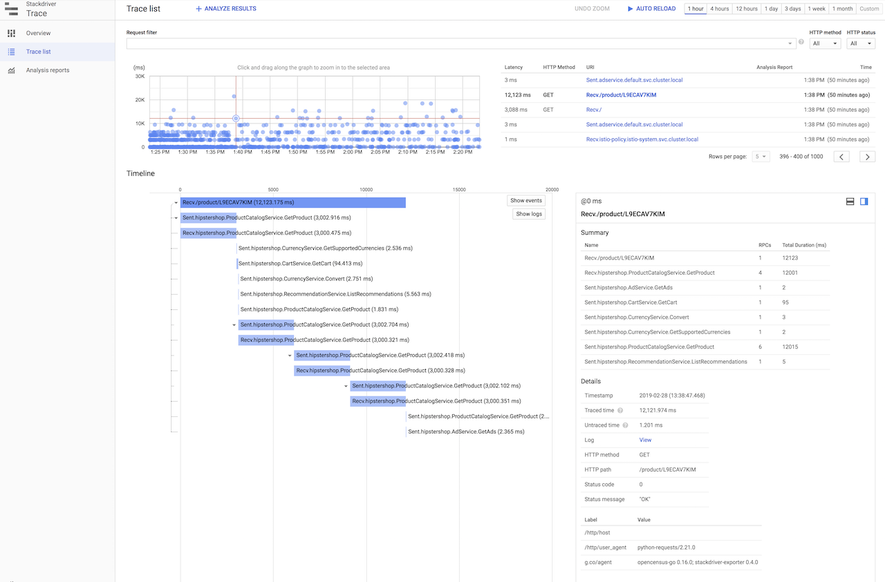
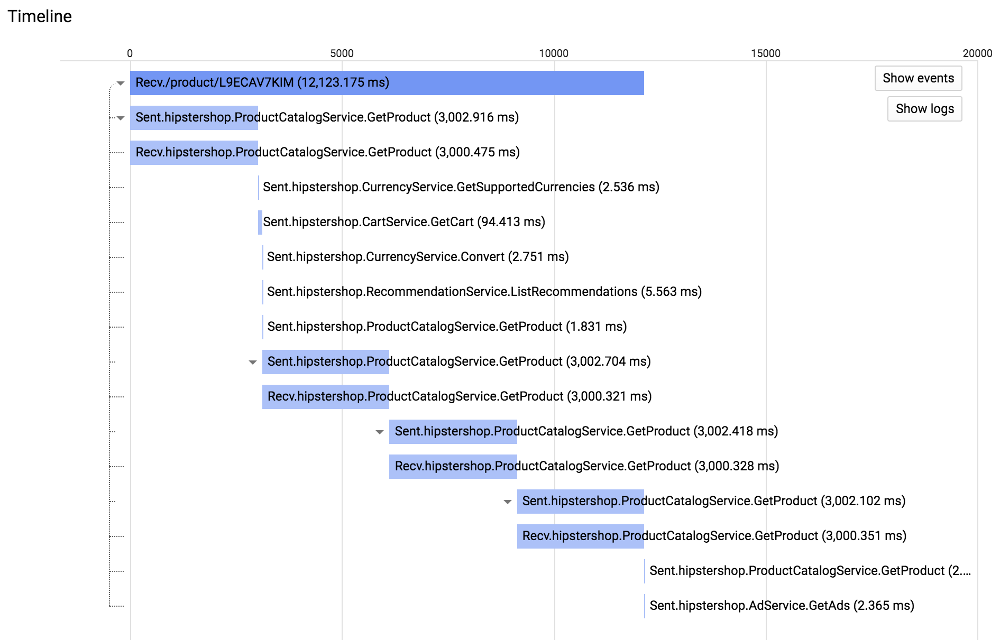
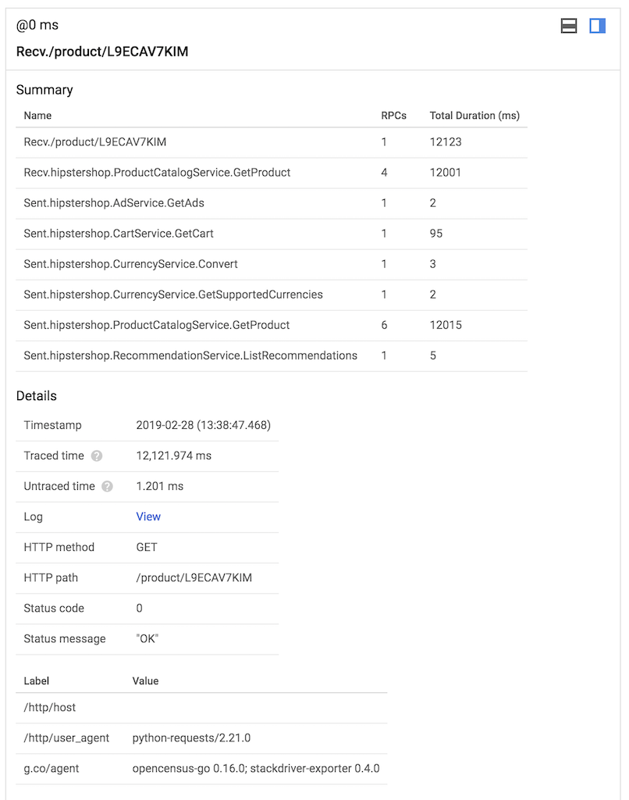
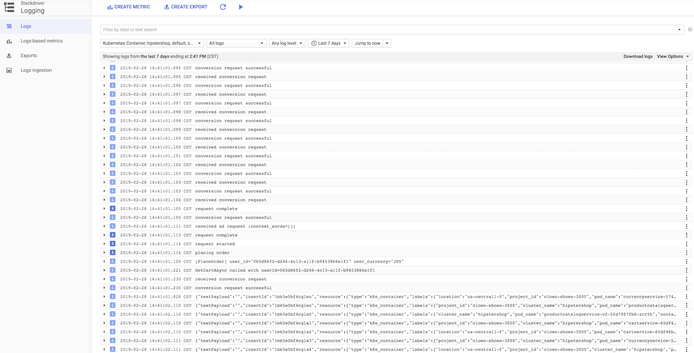
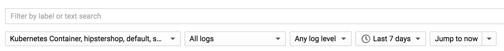

# Istio and Stackdriver

This example demonstrates the ways you can use [Stackdriver](https://cloud.google.com/stackdriver/) to gain insights into and debug microservices deployments running on GKE with [Istio's telemetry support](https://istio.io/docs/concepts/policies-and-telemetry/).

We'll deploy the Hipstershop sample application along with an updated service that introduces a 3-second latency into all requests. Then we'll create Stackdriver Monitoring dashboards to dig into key metrics like cluster and service health. Next, we'll use Stackdriver Trace to identify high latency requests. Finally, we'll dig into service output using Stackdriver Logging.

### Contents
- [Istio and Stackdriver](#istio-and-stackdriver)
    - [Contents](#contents)
  - [Setup](#setup)
    - [Create a GKE cluster](#create-a-gke-cluster)
    - [Deploy the sample application](#deploy-the-sample-application)
    - [Deploy a high latency service](#deploy-a-high-latency-service)
  - [Monitoring](#monitoring)
    - [Create a monitoring dashboard](#create-a-monitoring-dashboard)
    - [Examine service and cluster health](#examine-service-and-cluster-health)
  - [Tracing](#tracing)
    - [Review trace output](#review-trace-output)
    - [Identify high latency requests](#identify-high-latency-requests)
  - [Logging](#logging)
    - [Examine service logs](#examine-service-logs)
  - [Cleanup](#cleanup)
  - [Learn more](#learn-more)

## Setup
1. Clone the repo and change into the demo directory.

```
git clone https://github.com/GoogleCloudPlatform/istio-samples
cd istio-samples/common
```

### Create a GKE cluster

1. From Cloud Shell, **enable the Kubernetes Engine API**.

```
gcloud services enable container.googleapis.com
```

2. **Create a GKE cluster** using [Istio on GKE](https://cloud.google.com/istio/docs/istio-on-gke/overview). This add-on will provision your GKE cluster with Istio.

```
gcloud beta container clusters create istio-stackdriver-demo \
    --zone=us-central1-f \
    --machine-type=n1-standard-2 \
    --num-nodes=4
```

3. **Install Istio** on the cluster.

```
./install_istio.sh
```

4. Wait for all Istio pods to be `Running` or `Completed`.
```
kubectl get pods -n istio-system
```

*Note*: This Istio installation uses the default `PERMISSIVE` [mesh-wide security
option](https://istio.io/docs/reference/config/installation-options/#global-options).
This means that all services in the cluster will send unencrypted traffic by default.

### Deploy the sample application

1. Apply the sample app manifests to the cluster:

```
kubectl apply -f https://raw.githubusercontent.com/GoogleCloudPlatform/microservices-demo/master/release/kubernetes-manifests.yaml
kubectl apply -f https://raw.githubusercontent.com/GoogleCloudPlatform/microservices-demo/master/release/istio-manifests.yaml
kubectl patch deployments/productcatalogservice -p '{"spec":{"template":{"metadata":{"labels":{"version":"v1"}}}}}'
```

2. Run `kubectl get pods -n default` to ensure that all pods are `Running` and `Ready`.

```
NAME                                     READY     STATUS    RESTARTS   AGE
adservice-76b5c7bd6b-zsqb8               2/2       Running   0          1m
checkoutservice-86f5c7679c-8ghs8         2/2       Running   0          1m
currencyservice-5749fd7c6d-lv6hj         2/2       Running   0          1m
emailservice-6674bf75c5-qtnd8            2/2       Running   0          1m
frontend-56fdfb866c-tvdm6                2/2       Running   0          1m
loadgenerator-b64fcb8bc-m6nd2            2/2       Running   0          1m
paymentservice-67c6696c54-tgnc5          2/2       Running   0          1m
productcatalogservice-76c6454c57-9zj2v   2/2       Running   0          1m
recommendationservice-78c7676bfb-xqtp6   2/2       Running   0          1m
shippingservice-7bc4bc75bb-kzfrb         2/2       Running   0          1m
```

*Note*: Each pod has 2 containers, because each pod now has the injected Istio sidecar proxy.

### Deploy a high latency service

1. Create an Istio [DestinationRule](https://istio.io/docs/reference/config/istio.networking.v1alpha3/#DestinationRule) for `productcatalogservice`.

```
cd ../istio-canary-gke/
kubectl apply -f canary/destinationrule.yaml
```

2. Deploy `productcatalogservice` v2 which introduces a 3-second latency into all server requests.
```
kubectl apply -f canary/productcatalog-v2.yaml
```

3. Using `kubectl get pods`, verify that the `v2` pod is Running.
```
productcatalogservice-v2-79459dfdff-6qdh4   2/2       Running   0          1m
```

4. Create an Istio VirtualService to split incoming `productcatalogservice` traffic between v1 (75%) and v2 (25%).
```
kubectl apply -f canary/vs-split-traffic.yaml
```

## Monitoring

Now that we've deployed Hipstershop, along with an updated service that introduces higher latency to server requests, let's dig into how we can surface that latency via monitoring. Hipstershop includes a built-in load generator that issues requests across a number of services so after a few minutes you should start to see traffic hitting the deplyoment. The following steps will show you how to create a basic dashboard that let's you monitor some metrics for service and cluster health.

### Create a monitoring dashboard

1. Head over to [Stackdriver Monitoring](https://app.google.stackdriver.com/) and [create a Stackdriver Workspace](https://cloud.google.com/monitoring/workspaces/guide#single-project-ws).

2. Navigate to **Dashboards > Create Dashboard** in the left sidebar.

3. In the new Dashboard, click **Add Chart** and the following metric:

* **Metric**: Server Response Latencies (`istio.io/service/server/response_latencies`)
* **Group By**: `destination_workload_name`
* **Aligner**: 50th percentile
* **Reducer**: mean
* **Alignment Period**: 1 minute
* **Type**: Line

4. Click **Save Chart** in the upper right corner and repeat the process by adding new charts for each of the following metrics:

**Client Roundtrip Latencies**
* **Metric**: Client Roundtrip Latencies (`istio.io/service/client/roundtrip_latencies`)
* **Group By**: `destination_workload_name`
* **Aligner**: 50th percentile
* **Reducer**: mean
* **Alignment Period**: 1 minute
* **Type**: Line

**CPU Utilization**
* **Metric**: CPU Utilization (`compute.googleapis.com/instance/cpu/utilization`)
* **Resource Type**: GCE VM Instance
* **Filter**: `goog-gke-node` = ""
* **Aligner**: mean
* **Reducer**: none
* **Alignment Period**: 1 minute
* **Type**: Line

**Memory Usage**
* **Metric**: Memory Usage (`kubernetes.io/node/memory/used_bytes`)
* **Group By**: `node_name`
* **Aligner**: mean
* **Reducer**: mean
* **Alignment Period**: 1 minute
* **Type**: Line

5. After the metrics have been added, you will have a Dashboard that looks similar to the following:



### Examine service and cluster health

1. Now that you have a functioning Dashboard and some load has been generated, take a look at **Server Response Latencies** and **Client Roundtrip Latencies** charts. You will see there are some clear outliers, specifically the `productcatalog` service. You will also see other related services (such as `frontend`) also have latency spikes. This is because the [frontend relies on](https://github.com/GoogleCloudPlatform/microservices-demo#service-architecture) ProductCatalog, for which 25% of requests are routing through the slower `v2` deployment.


Also take a look at the **CPU Utilization** and **Memory Usage** charts and you'll notice that there are no significant outliers there. As expected, the issue isn't with the GKE cluster itself, it's due to the fact that we specifically deployed a service that introduced a 3-second per request latency.

## Tracing

Now that the high latency service (`productcatalogservice`) has been identified, we can use [Stackdriver Trace](https://cloud.google.com/trace/) to dig in and examine the latency impact it's having across the entire deployment.

### Review trace output

1. Open [Stackdriver Trace](https://console.cloud.google.com/traces) and you will see the tracing overview.

The left side of the **Overview** contains
* **Recent traces** captured
* **Most frequent URIs** requested
* **Most frequent RPCs** called

And on the right you'll see automated analysis reports. These reports are generated by the system and correspond to some of the recent and/or high frequency requests/calls.



2. From the left navigation, head over to the **Trace List** and you'll see a chart of all requests plotted against latency along with a table of the most recent 1000 traces.



### Identify high latency requests

1. From the **Trace List** chat, select a high latency outlier and you'll see a **Timeline** and **Summary** appear below.



2. The timeline shows an initial request and the subsequent requests it generated. In the example below, you can see that requesting the URL `/product/L9ECAV7KIM` took about 12.1s, primarily due to the subsequent requests to the `productcatalogservice` (which has an extra 3s of latency added to each request).



3. The **Summary** table to the right aggregates all of the outbound RPC requests and their total duration, along with additional metadata about the initial request itself.



## Logging

At this point, we've been able to
- Identify a high latency service `productcatalogservice` using Stackdriver Monitoring
- Examine the impact that service is having by digging through request traces using Stackdriver Trace

The final step is to look at the logs generated by our services to see if there's any additional debug information we can capture. Using [Stackdriver Logging](https://cloud.google.com/logging/) we can examine individual service logs from our deployment.

### Examine service logs

1. Open [Stackdriver Logging](https://console.cloud.google.com/logs/viewer) and you'll see the logs viewer.



2. Using the **Filter** field and controls, you can select which logs you want to view. In the example below we used the following filter:
- **Resource**: Kubernetes Container
- **Cluster Name**: istio-stackdriver-demo
- **Namespace**: default
- **Container Name**: server



*Note*: In our example, we manually injected the latency into `productcatalogservice-v2` so these example logs won't be of much help.

## Cleanup

Once you're all done, delete the GKE cluster:
```
gcloud container clusters delete istio-stackdriver-demo
```

## Learn more

- [Istio Policies and Telemetry](https://istio.io/docs/concepts/policies-and-telemetry/)
- [Istio In-Depth Telemetry](https://istio.io/docs/examples/telemetry/)
- [Drilling down into Stackdriver Service Monitoring](https://cloud.google.com/blog/products/gcp/drilling-down-into-stackdriver-service-monitoring) (GCP blog)