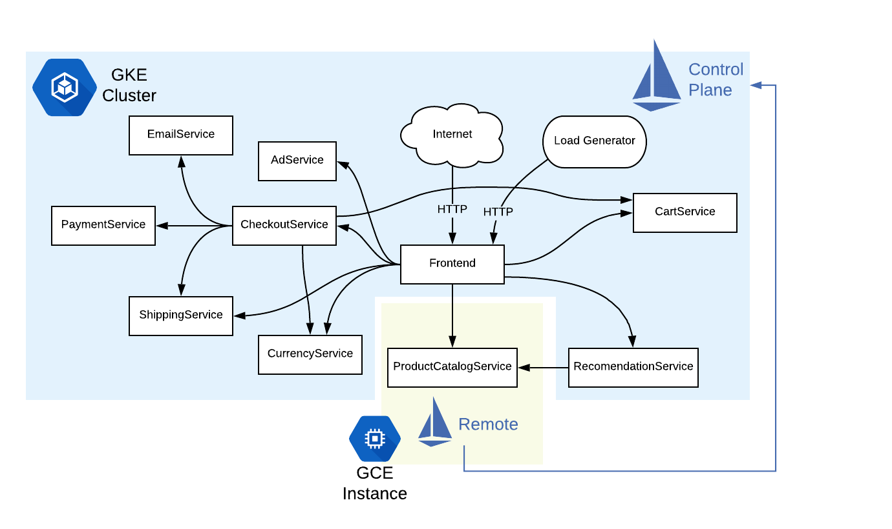
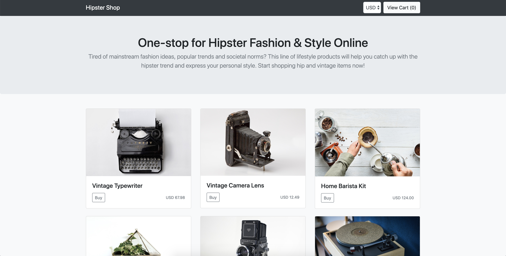

# Demo: Integrating a Google Compute Engine VM with Istio

This demo shows how to connect a Google Compute Engine virtual machine to an Istio service
mesh running in Google Kubernetes Engine.

This example is relevant if you're running an application outside
of Kubernetes, but still want to enjoy the full benefits of Istio for that service.

We will use the [Hipstershop](https://github.com/GoogleCloudPlatform/microservices-demo) sample app for this demo, with the following topology:



Here, the `productcatalog` service will be our "monolith" running in a VM outside of
Kubernetes. For demonstration purposes, we'll run productcatalog in a raw Docker container
inside the VM, then integrate it with the rest of the in-mesh services running in GKE.

## prerequisites

- A GCP project with billing enabled
- helm CLI
- gcloud
- kubectl


## GCP Setup

For this demo, the GCE VM and the GKE cluster will live in the same GCP project. Set an
environment variable for your project ID.


```
export PROJECT_ID=<your-project-id>
```

## 1- Create a GKE Cluster

Create a 4-node GKE cluster named `mesh-exp-gke`:

```
./scripts/1-create-gke.sh
```

Wait for the GKE cluster to be `RUNNING` -

```
gcloud container clusters list
```

Connect to the cluster:

```
gcloud container clusters get-credentials mesh-exp-gke --zone us-central1-b --project $PROJECT_ID
```

## 2- Install Istio on GKE

*Optional*: Set [Istio Version](https://github.com/istio/istio/releases):

```
ISTIO_VERSION=<version>
```

Install Istio on the cluster:

```
./scripts/2-install-istio-gke.sh
```

## 3- Create a GCE Instance

This script will create a Ubuntu GCE instance in your GCP Project. The VM is named `istio-gce`.

```
./scripts/3-create-gce.sh
```

## 4- Prepare the VM for Mesh Expansion

In order for mesh expansion to work, we must send Istio information from GKE to the VM.
This includes a script, which will run on the VM in step 6.

```
./scripts/4-configure-mesh-exp.sh
```

At the end of the script output, you should see:

```
6-configure-vm.sh                                                    100% 1806    48.4KB/s   00:00
cluster.env                                                          100%   83     2.3KB/s   00:00
cert-chain.pem                                                       100% 1139    31.4KB/s   00:00
key.pem                                                              100% 1675    46.3KB/s   00:00
root-cert.pem                                                        100% 1054    29.6KB/s   00:00
...done.
```

## 5- Add VM to the GKE Istio Mesh

```
./scripts/5-expand-mesh.sh
```

You will see some long output from `istioctl register`. If the VM Endpoint registration
is successful, you should see this message:

```
	Successfully updated productcatalogservice, now with 1 endpoints
```

Then, check to make sure a service exists for the VM-based productcatalog.
`EXTERNAL_IP` should be `none`, since we aren't directly exposing productcatalog to the Internet.

```
$ kubectl get svc

NAME                    TYPE        CLUSTER-IP    EXTERNAL-IP   PORT(S)    AGE
kubernetes              ClusterIP   10.79.0.1     <none>        443/TCP    51m
productcatalogservice   ClusterIP   10.79.6.227   <none>        3550/TCP   43s
```

## 6- Install Istio on the VM / Run ProductCatalog

To finish up Istio Mesh Expansion, we must ssh into the VM:

```
gcloud compute --project $PROJECT_ID ssh --zone "us-central1-b" "istio-gce"
```

From the VM, run the mesh expansion script:

```
chmod +x ./6-configure-vm.sh; ./6-configure-vm.sh
```

This script:
- installs Docker on the VM
- downloads the Istio remote binary
- runs the Istio remote components (`pilot-agent` and `node-agent`)
- configures the Istio remote to "call home" to Istio running on your GKE cluster
- runs ProductCatalog inside a Docker container.

When the script runs successfully, you should be able to run:

```
sudo docker ps
```

And you should see the ProductCatalog container running:
```
CONTAINER ID        IMAGE                                                                   COMMAND                  CREATED             STATUS              PORTS                    NAMES
521d9d0de04b        gcr.io/google-samples/microservices-demo/productcatalogservice:v0.1.0   "/productcatalogserv…"   2 minutes ago       Up 2 minutes        0.0.0.0:3550->3550/tcp   inspiring_hawking
```

Exit out of the VM shell.

## 7- Deploy Hipstershop

The last step is to deploy the rest of Hipstershop (without ProductCatalog) on the Istio-enabled GKE
cluster.

**Note**: The Hipstershop Deployments, here, refer to `productcatalog` as if it were an
in-mesh service (`productcatalogservice:3550`). This is because in step 5, we created a
`ServiceEntry` of type `MESH_INTERNAL` for our VM / port 3550.

Deploy the app:

```
./scripts/7-deploy-hipstershop.sh
```

And wait until all the pods are running:

```
NAME                                     READY   STATUS    RESTARTS   AGE
adservice-6cd6965787-29zk8               2/2     Running   0          4m
cartservice-57c6949b9-cgmf9              2/2     Running   0          4m
checkoutservice-6848667dd7-md66j         2/2     Running   0          4m
currencyservice-668f49f985-zmvwk         2/2     Running   0          4m
emailservice-796bb9588b-8c55p            2/2     Running   0          4m
frontend-6dcd4969b4-hn6z8                2/2     Running   0          4m
paymentservice-548657568f-lnnn9          2/2     Running   0          4m
recommendationservice-5fb85f46df-kslhp   2/2     Running   0          4m
shippingservice-5f5d75bf65-q6cf5         2/2     Running   0          4m
```

## Verify that mesh expansion is working

Get the Frontend's `EXTERNAL_IP` address:

```
kubectl get svc -n istio-system istio-ingressgateway
```


Then open Hipstershop in the browser using that IP. if you see a list of products (fetched
from ProductCatalog), this means that the `frontend` service can successfully use our
`ServiceEntry` to reach `productcatalog` running in the GCE VM.



Congratulations, you just set up Istio Mesh Expansion on GCP! 🎉

## Clean up

To delete the GCE VM:

```
gcloud compute instances --project $PROJECT_ID delete --zone "us-central1-b" "istio-gce"
```

To delete the GKE cluster:

```
gcloud container clusters delete mesh-exp-gke --zone us-central1-b
```


## Learn More

To read more about VM Mesh Expansion with Istio, see the [Istio documentation](https://preliminary.istio.io/docs/setup/kubernetes/additional-setup/mesh-expansion/).

Or to run another Mesh Expansion example (BookInfo and MySQL), see the
[example](https://preliminary.istio.io/docs/examples/integrating-vms/).
