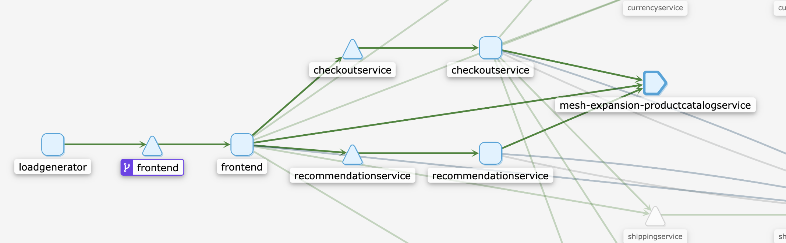
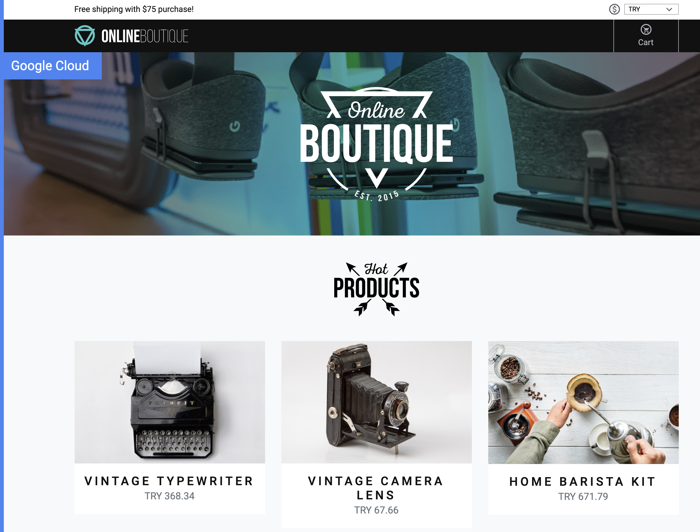

# Demo: Integrating a Google Compute Engine VM with Istio

This demo shows how to connect a Google Compute Engine virtual machine to an Istio service
mesh running in Google Kubernetes Engine.

This example is relevant if you're running an application outside
of Kubernetes, but still want to enjoy the full benefits of Istio for that service.

We will use the [Hipstershop](https://github.com/GoogleCloudPlatform/microservices-demo) sample app for this demo, with the following topology:


Here, the `productcatalog` service will be our "monolith" running in a VM outside of
Kubernetes. For demonstration purposes, we'll run productcatalog in a raw Docker container
inside the VM, then integrate it with the rest of the in-mesh services running in GKE.

## Prerequisites

- A GCP project with billing enabled
- gcloud
- kubectl


## GCP Setup

For this demo, the GCE VM and the GKE cluster will live in the same GCP project. Set an
environment variable for your project ID.


```
export PROJECT_ID=<your-project-id>
```

## Create a GKE Cluster

Create a 4-node GKE cluster named `mesh-exp-gke`:

```
./scripts/1-create-cluster.sh
```

Wait for the GKE cluster to be `RUNNING` -

```
gcloud container clusters list
```

Connect to the cluster:

```
gcloud container clusters get-credentials mesh-exp-gke --zone us-central1-b --project $PROJECT_ID
```


## Create a GCE Instance

This script will create a Ubuntu GCE instance in your GCP Project. The VM is named `istio-gce`.

```
./scripts/2-create-vm.sh
```

## Install Istio on the cluster

```
./scripts/3-install-istio.sh
```


## Deploy the rest of the sample application to GKE

This step deploys all the services expect `productcatalog` to the GKE cluster, in the Istio-injected `default` namespace.

```
./scripts/4-deploy-hipstershop.sh
```

## Prepare the cluster for the VM.

```
./scripts/5-prep-cluster.sh
```

This step generates a cluster.env file containing the Istio service CIDR (pod IP ranges for your cluster) and the inbound ports - since productcatalog will listen on grpc port `3550` on the VM, we specify port `3550` for the VM proxy to intercept.

This step also creates client certificate files that we'll send to the VM. In the end, your `cluster.env` file should look like this:

```
ISTIO_SERVICE_CIDR=10.87.0.0/20

ISTIO_INBOUND_PORTS=3550,8080
```

## Set up the VM for Istio.

```
./scripts/6-prep-vm.sh
```

This script does the following:
- Sends the certs and `cluster.env` file we just created to the VM, via `scp`
- Logs into the VM via `ssh`
- From the VM, installs the Istio sidecar proxy and updates `/etc/hosts` so that the VM can reach istiod running on the GKE cluster
- Installs Docker
- Runs the `productcatalogservice` on the VM, as a plain Docker container

## Add productcatalog to the mesh

```
./scripts/7-add-to-mesh.sh
```

This step uses the `istioctl add-to-mesh` command to generate a ServiceEntry and headless Service corresponding to the VM `productcatalogservice`. This allows the frontend running as a GKE pod to resolve the `productcatalogservice` DNS to the GCE VM, via Istio.

## Start the Istio proxy on the VM

```
./scripts/8-start-vm-istio.sh
```

## View the service topology

```
alias istioctl="../common/istio-1.5.2/bin/istioctl"
istioctl dashboard kiali &
```

Open Service Graph > click the "default" namespace. You should see traffic moving to the `meshexpansion-productcatalogservice` ServiceEntry, corresponding to the VM.



## Open the frontend in a browser

Get the external IP address of the Istio ingressgateway. Navigate to that IP address in a web browser.

```
kubectl get svc -n istio-system istio-ingressgateway | awk '{print $4}'
```

You should see the sample app frontend with a list of products, fetched from `productcatalog` running on the VM.



## Clean up

To delete the resources used in this sample:

```
gcloud compute firewall-rules delete k8s-to-istio-gce
gcloud compute instances --project $PROJECT_ID delete --zone "us-central1-b" "istio-gce"
gcloud container clusters delete mesh-exp-gke --zone us-central1-b --async
```

## Learn more

Learn about each step of the VM install in the [Istio documentation](https://istio.io/docs/examples/virtual-machines/single-network/#preparing-the-kubernetes-cluster-for-vms).

Learn [how to set up a proxy-injected VM in another network](https://istio.io/docs/examples/virtual-machines/multi-network/).