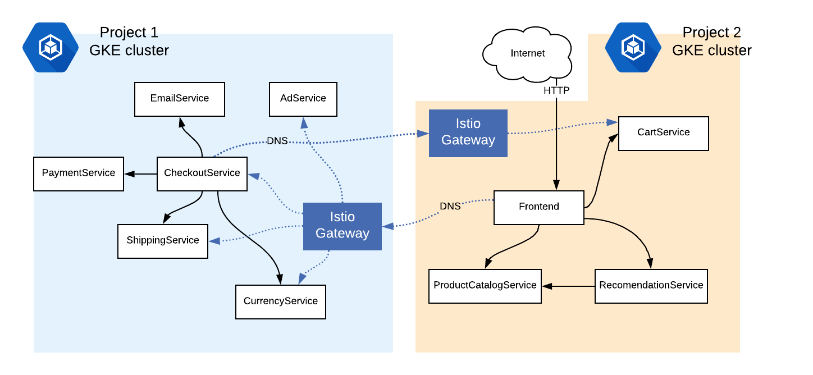

# Demo: Multicluster Istio - Gateway-Connected Clusters

This example shows how to orchestrate an application with [Istio](https://istio.io/) across two different
Google Kubernetes Engine clusters. To do this, we will unite two different Istio service meshes into
one logical, hybrid mesh.



This example is relevant if you run microservices on two different cloud platforms, or are
using a combination of on-prem and cloud Kubernetes. For demonstration purposes here, we'll use two GKE clusters in two different projects, and thus two
different [virtual networks](https://cloud.google.com/kubernetes-engine/docs/concepts/network-overview#inside-cluster).

## How it works

This demo uses Istio 1.4's [Gateway-Connected Clusters](https://preliminary.istio.io/docs/concepts/multicluster-deployments/#multiple-control-plane-topology) feature. This is a specific mode of
multicluster Istio where two separate Kubernetes clusters run their own Istio control
plane, and orchestrate their own mesh. But each Istio control plane also runs a CoreDNS
server, which allows services in both clusters to refer to services in the other cluster,
as if they were part of their own mesh. A service in cluster 1 can call a
cluster 2 service with a DNS name of the format `svc-name.cluster-2-namespace.global`.
The Kubernetes DNS server and Istio's CoreDNS know how to work together to resolve that
`global` DNS suffix.


## Prerequisites

- Two GCP projects with billing and the Kubernetes API enabled
- `gcloud` CLI
- `kubectl`
- `helm` CLI


## Set Project Variables

```
export PROJECT_1=<your-project1>

export PROJECT_2=<your-second-project>
```

## Create Two GKE Clusters

```
./scripts/1-create-gke-clusters.sh
```

Then, run:

```
watch -n 1 gcloud container clusters list
```

And wait for both clusters to be `RUNNING`.

## Install Istio on Both Clusters

```
./scripts/2-install-istio.sh
```

Wait for all Istio pods to be `RUNNING` -

```
NAME                                    READY   STATUS    RESTARTS
 AGE
grafana-556b649566-4fwb9                1/1     Running   0
 2m28s
istio-egressgateway-79ffd95b56-zf2vg    1/1     Running   0
 8m18s
istio-ingressgateway-6df84b84d4-dp9rw   1/1     Running   0
 8m17s
istio-tracing-7cf5f46848-pzmf7          1/1     Running   0
 2m28s
istiocoredns-5f7546c6f4-gjl2x           2/2     Running   0
 8m17s
istiod-8465c8f9d9-pxb6v                 1/1     Running   0
 8m38s
kiali-6d54b8ccbc-9qhc9                  1/1     Running   0
 2m28s
prometheus-75f89f4df8-gd5mn             2/2     Running   0
 8m16s
```

## Configure KubeDNS to talk to Istio's CoreDNS

You'll notice `istiocoredns` in the list of pods. This DNS server which will handle DNS resolution across
cluster boundaries.

The next step configures the Kubernetes server (kubedns) to with a
DNS
[stub domain](https://kubernetes.io/docs/tasks/administer-cluster/dns-custom-nameservers/#configure-stub-domain-and-upstream-dns-servers)
to talk to this auxiliary Istio CoreDNS server.
A StubDomain is a forwarding rule for DNS addresses with a certain prefix.

Run the script to configure the stub domain on both GKE clusters:

```
./scripts/3-configure-dns.sh
```


## Deploy the Sample App

We will now deploy [Online Boutique, a sample application](https://github.com/GoogleCloudPlatform/microservices-demo), across our two GKE clusters.

For demonstration purposes, we've split the microservices into two halves. One group
will run on Cluster 1 (namespace `hipster1`):

- emailservice
- checkoutservice
- paymentservice
- currencyservice
- shippingservice
- adservice

And another group will run on Cluster 2 (namespace
`hipster2`):

- frontend
- productcatalogservice
- recommendationservice
- cartservice (configured to use a local store, not Redis)


Visually, we will deploy this topology:


The following script creates the following resources on both GKE clusters:
- Kubernetes Deployments for the services assigned to this cluster
- Kubernetes Services for the services that *are* running local to this cluster
- ServiceEntries (type `MESH_INTERNAL`) for all the services *not* running on this cluster. **Note**: for each
  of these external ServiceEntries, the script injects the Istio `IngressGateway` IP for the
  opposite cluster. This is how CoreDNS will be able to resolve `global` to an actual
  external Istio IP.
- ServiceEntries (type `MESH_EXTERNAL`) to access external Google APIs (necessary for
  Online Boutique to run)
- Istio VirtualServices / Gateway (for cluster 2 / the frontend only)

Run the script to deploy these resources across both clusters:

```
./scripts/4-deploy-online-boutique.sh
```


## Verify successful deployment

1. Get pods in cluster 1 (namespace `hipster1`) to make sure all are `RUNNING` -

```
NAME                               READY   STATUS    RESTARTS   AGE
adservice-84449b8756-4nhpm         2/2     Running   0          3m29s
checkoutservice-8dfb487c6-rwh9n    2/2     Running   0          3m30s
currencyservice-b9fcb4c98-98q7x    2/2     Running   0          3m29s
emailservice-57f9ddf9b9-hmpv7      2/2     Running   0          3m30s
paymentservice-84d7bf956-8f9br     2/2     Running   0          3m29s
shippingservice-78dc8784d4-7h4zx   2/2     Running   0          3m29s
```

2. Get pods in cluster 2 (namespace `hipster2`) to make sure all are `RUNNING` -

```
NAME                                     READY   STATUS    RESTARTS
  AGE
cartservice-5b88d44bd-t6s6c              2/2     Running   0
2m31s
frontend-7958cf4f9-r2b9m                 2/2     Running   0
  2m32s
productcatalogservice-c796f4c6d-qgfp8    2/2     Running   0
  2m32s
recommendationservice-6788b77796-z4xq8   2/2     Running   0
  2m31s
```

3. Get the Ingress Gateway `EXTERNAL_IP` in `cluster2`, where the web `frontend` is deployed:

```
kubectl config use-context gke_${PROJECT_2}_us-central1-b_dual-cluster2
kubectl get svc -n istio-system istio-ingressgateway
```

Navigate to that address in a browser.


4. View the service graph.

From `cluster2`, open the Kiali service graph dashboard.

```
../../common/istio-1.5.2/bin/istioctl dashboard kiali &
```

Log in as `admin/admin`. Navigate to Graph > Service Graph > namespace: `default`. You should see traffic moving from the `frontend` on cluster2, to services running in both cluster2 (eg. `productcatalogservice`) and in cluster1 (eg. `adservice`). Note that in-cluster traffic within cluster1 is not visible in cluster2's Kiali dashboard.


Congrats! you just deployed Multicluster Istio across
two separate networks, then ran an application that spanned two Kubernetes
environments! All part of a single, two-headed Service Mesh. 🎉


## Clean up

Delete the 2 GKE clusters:

```
./scripts/cleanup-delete-clusters.sh
```

## Further reading

- To learn about Multicluster Istio and its different modes, [see the Istio docs](https://istio.io/docs/concepts/multicluster-deployments/)
- To learn how to configure and install the different modes, see the [Setup](https://istio.io/docs/setup/install/multicluster/) section in the Istio docs.
