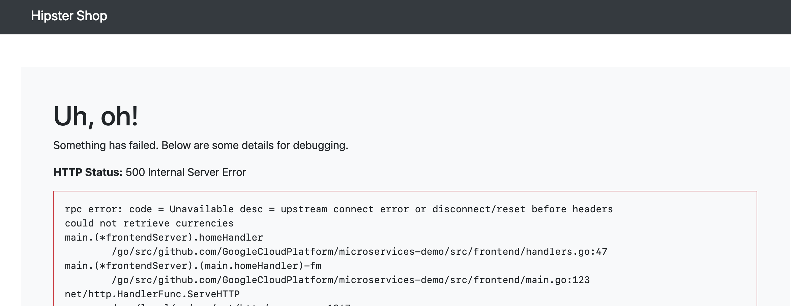

# Demo: Multicluster Istio - Gateway-Connected Clusters

This example shows how to orchestrate an application with [Istio](https://istio.io/) across two different
Google Kubernetes Engine clusters. To do this, we will unite two different Istio service meshes into
one logical, hybrid mesh.


This example is relevant if you run microservices on two different cloud platforms, or are
using a combination of on-prem and cloud Kubernetes. For demonstration purposes here, we'll use two GKE clusters in two different projects, and thus two
different [virtual networks](https://cloud.google.com/kubernetes-engine/docs/concepts/network-overview#inside-cluster).

## How it works

This demo uses Istio 1.4's [Gateway-Connected Clusters](https://preliminary.istio.io/docs/concepts/multicluster-deployments/#multiple-control-plane-topology) feature. This is a specific mode of
multicluster Istio where two separate Kubernetes clusters run their own Istio control
plane, and orchestrate their own mesh. But each Istio control plane also runs a CoreDNS
server, which allows services in both clusters to refer to services in the other cluster,
as if they were part of their own mesh. A service in cluster 1 can call a
cluster 2 service with a DNS name of the format `svc-name.cluster-2-namespace.global`.
The Kubernetes DNS server and Istio's CoreDNS know how to work together to resolve that
`global` DNS suffix.


## Prerequisites

- Two GCP projects with billing and the Kubernetes API enabled
- `gcloud` CLI
- `kubectl`
- `helm` CLI


## Set Project Variables

```
export PROJECT_1=<your-project1>

export PROJECT_2=<your-second-project>
```

## Create Two GKE Clusters

```
./scripts/1-create-gke-clusters.sh
```

Then, run:

```
watch -n 1 gcloud container clusters list
```

And wait for both clusters to be `RUNNING`.

## Install Istio on Both Clusters

```
./scripts/2-install-istio.sh
```

Wait for all Istio pods to be `RUNNING` and `READY`:

```
NAME                                     READY   STATUS      RESTARTS   AGE
istio-citadel-5f5f589d85-ngwzx           1/1     Running     0          2m10s
istio-egressgateway-586b67d9f9-rvgdl     1/1     Running     0          2m10s
istio-galley-69dddcdb6d-ftc9k            1/1     Running     0          2m10s
istio-ingressgateway-6cb57df9d5-s82ml    1/1     Running     0          2m10s
istio-init-crd-10-44ftr                  0/1     Completed   0          3m41s
istio-init-crd-11-bbf6m                  0/1     Completed   0          3m41s
istio-init-crd-12-gd2fc                  0/1     Completed   0          3m41s
istio-pilot-55b94698c4-5s8l4             2/2     Running     0          2m10s
istio-policy-68b4bf556d-9l7sj            2/2     Running     2          2m10s
istio-sidecar-injector-68bf9645b-2qfrv   1/1     Running     0          2m10s
istio-telemetry-659fc8767d-4qt9h         2/2     Running     2          2m10s
istiocoredns-586757d55d-bjzz9            2/2     Running     0          2m10s
prometheus-5b48f5d49-pdsts               1/1     Running     0          2m10s
```

## Configure KubeDNS to talk to Istio's CoreDNS

You'll notice `istiocoredns` in the list of pods. This DNS server which will handle DNS resolution across
cluster boundaries.

The next step configures the Kubernetes server (kubedns) to with a
DNS
[stub domain](https://kubernetes.io/docs/tasks/administer-cluster/dns-custom-nameservers/#configure-stub-domain-and-upstream-dns-servers)
to talk to this auxiliary Istio CoreDNS server.
A StubDomain is a forwarding rule for DNS addresses with a certain prefix.

Run the script to configure the stub domain on both GKE clusters:

```
./scripts/3-configure-dns.sh
```


## Deploy the Sample App

We will now deploy [Hipstershop, a sample application](https://github.com/GoogleCloudPlatform/microservices-demo), across our two GKE clusters.

For demonstration purposes, we've split the microservices into two halves. One group
will run on Cluster 1 (namespace `hipster1`):

- emailservice
- checkoutservice
- paymentservice
- currencyservice
- shippingservice
- adservice

And another group will run on Cluster 2 (namespace
`hipster2`):

- frontend
- productcatalogservice
- recommendationservice
- cartservice (configured to use a local store, not Redis)


Visually, we will deploy this topology:


The following script creates the following resources on both GKE clusters:
- Kubernetes Deployments for the services assigned to this cluster
- Kubernetes Services for the services that *are* running local to this cluster
- ServiceEntries (type `MESH_INTERNAL`) for all the services *not* running on this cluster. **Note**: for each
  of these external ServiceEntries, the script injects the Istio `IngressGateway` IP for the
  opposite cluster. This is how CoreDNS will be able to resolve `global` to an actual
  external Istio IP.
- ServiceEntries (type `MESH_EXTERNAL`) to access external Google APIs (necessary for
  Hipstershop to run)
- Istio VirtualServices / Gateway (for cluster 2 / the frontend only)

Run the script to deploy these resources across both clusters:

```
./scripts/4-deploy-hipstershop.sh
```


## Verify successful deployment

Get the Ingress Gateway `EXTERNAL_IP` in `cluster2`, where the web `frontend` is deployed:

```
kubectl config use-context gke_${PROJECT_2}_us-central1-b_dual-cluster2
kubectl get svc -n istio-system istio-ingressgateway
```

Navigate to that address in a browser.

If you see the frontend, you just deployed Multicluster Istio across
two separate networks, then ran an application that spanned two Kubernetes
environments! All part of a single, two-headed Service Mesh. 🎉


## Troubleshooting


If you open Hipstershop in a browser, and see a `500` error like this:



This means the Frontend (in cluster 2) cannot access services running on cluster 1.

To debug, make sure that the Frontend's Envoy sidecar can ping a cluster-1 service:

```
$ kubectl exec -it frontend-85d9fd86f8-8gkpq -c istio-proxy -n hipster2 /bin/sh

$ ping currencyservice.hipster1.global
PING currencyservice.hipster1.global (127.255.0.4) 56(84) bytes of data.
64 bytes from 127.255.0.4: icmp_seq=1 ttl=64 time=0.030 ms
```


## Clean up

Delete the 2 GKE clusters:

```
./scripts/cleanup-delete-clusters.sh
```

## Further reading

- To learn about Multicluster Istio and its different modes, [see the Istio docs](https://istio.io/docs/concepts/multicluster-deployments/)
- To learn how to configure and install the different modes, see the [Setup](https://istio.io/docs/setup/install/multicluster/) section in the Istio docs.
