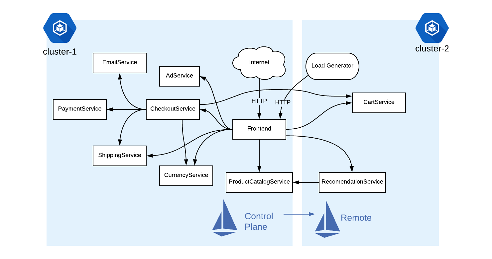
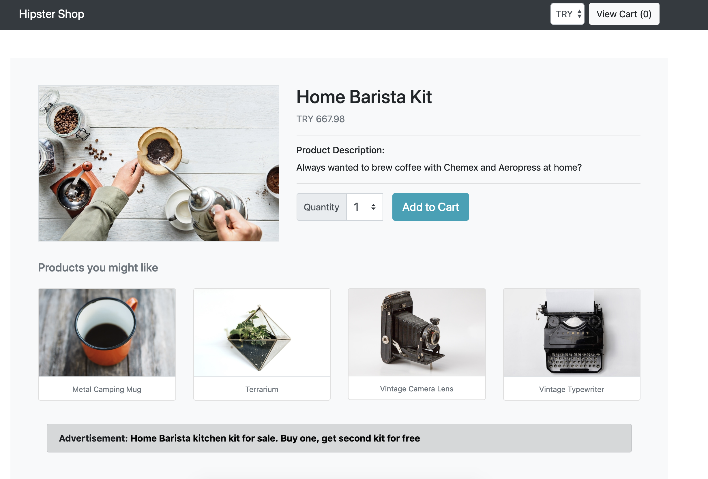

# Demo: Multicluster Istio- Single Control Plane

This demo shows how to use Istio to orchestrate [an application](https://github.com/GoogleCloudPlatform/microservices-demo) running across two Google
Kubernetes Engine clusters in the same project, but across two different [zones](https://cloud.google.com/compute/docs/regions-zones/#identifying_a_region_or_zone).



### Prerequisites

1. a GCP project with Billing enabled.
2. gcloud
3. kubectl
4. [helm CLI](https://github.com/helm/helm/releases), installed wherever you're running
   these commands (Google Cloud shell, laptop,
   etc.) Note that we are only using the `helm template` command in this demo (ie. [Tiller](https://helm.sh/docs/glossary/#tiller)
   not required on any of the Kubernetes clusters).

## Create two GKE clusters

Set the project ID to your GCP Project:

```
export PROJECT_ID=<your-GCP-project-ID>
```

Then run the script to create two GKE clusters in your project:

```
./scripts/1-cluster-create.sh
```

Then, run:

```
watch -n 1 gcloud container clusters list
```

Wait for both clusters to be `RUNNING`.

## Connect to clusters

This script creates kubeconfigs for both clusters, to allow future `kubectl` commands to
switch back and forth between them.

```
./scripts/2-get-credentials.sh
```

## Create a GKE Firewall Rule

This step allows pods on both clusters to communicate directly.

```
./scripts/3-firewall.sh
```


## Install the Istio Control Plane on Cluster 1

This step installs the Istio control plane on one of the GKE clusters.

```
./scripts/4-cluster1-install.sh
```


## Install the Istio Remote on Cluster 2

Now we'll install the remote Istio components (Citadel's node-agent, and an Envoy sidecar injector) on Cluster 2.

```
./scripts/5-cluster2-install.sh
```


## Connect Cluster 2 to Cluster 1

This step generates a [Kubeconfig](https://kubernetes.io/docs/tasks/access-application-cluster/configure-access-multiple-clusters/#define-clusters-users-and-contexts) file for the remote cluster 2, then adds it as a [Secret](https://kubernetes.io/docs/concepts/configuration/secret/)
to Cluster 1. This step allows the Istio control plane on cluster 1 to configure Istio proxies on cluster 2.

```
./scripts/6-connect-clusters.sh
```


## Deploy [Hipstershop](https://github.com/GoogleCloudPlatform/microservices-demo)

This script deploys the sample application across both cluster 1 and cluster 2. We have
split the microservices in the application so that some run centrally to the Istio control
plane (cluster 1), and the rest run on the remote Istio cluster (cluster 2):


Run the script to deploy:

```
./scripts/7-deploy-hipstershop.sh
```

*Note*:  This script uses the default Hipstershop installation, which deploys all services to the cluster, then deletes the deployments that belong on the other cluster. Both clusters need Kubernetes Services for all the Hipstershop workloads, in order for cross-cluster DNS to work.

You can verify that the multicluster deployment was successful using 3 methods:

1. Run `kubectl get pods` on both clusters to ensure all pods are `RUNNING` and `READY`.

2. From cluster-1, run `istioctl proxy-status`. You should see cluster-2 services (eg.
   `cartservice`) appear in the list. This means that the Istio control plane can
   successfully configure Envoy proxies running on the remote GKE cluster-2.

```
NAME                                                   CDS        LDS        EDS        RDS        PILOT                       VERSION
adservice-86674bf94d-gq52w.default                     SYNCED     SYNCED     SYNCED     SYNCED     istiod-6c6c489d84-8rgnr     1.5.2
checkoutservice-74df4f44c8-b6xlq.default               SYNCED     SYNCED     SYNCED     SYNCED     istiod-6c6c489d84-8rgnr     1.5.2
currencyservice-6444b89474-ln4zp.default               SYNCED     SYNCED     SYNCED     SYNCED     istiod-6c6c489d84-8rgnr     1.5.2
emailservice-c98d5d48d-5pg65.default                   SYNCED     SYNCED     SYNCED     SYNCED     istiod-6c6c489d84-8rgnr     1.5.2
frontend-67dcdc8cf8-z64jh.default                      SYNCED     SYNCED     SYNCED     SYNCED     istiod-6c6c489d84-8rgnr     1.5.2
istio-ingressgateway-5b477bdb4f-l9fw2.istio-system     SYNCED     SYNCED     SYNCED     SYNCED     istiod-6c6c489d84-8rgnr     1.5.2
paymentservice-579d78fc44-r65wp.default                SYNCED     SYNCED     SYNCED     SYNCED     istiod-6c6c489d84-8rgnr     1.5.2
productcatalogservice-65794cb878-bb6zf.default         SYNCED     SYNCED     SYNCED     SYNCED     istiod-6c6c489d84-8rgnr     1.5.2
prometheus-7bc49f57-mjhqx.istio-system                 SYNCED     SYNCED     SYNCED     SYNCED     istiod-6c6c489d84-8rgnr     1.5.2
shippingservice-794b4d66bb-prc9j.default               SYNCED     SYNCED     SYNCED     SYNCED     istiod-6c6c489d84-8rgnr     1.5.2
```

3. open Hipstershop in the browser by getting the Istio `IngressGateway`'s `EXTERNAL_IP`:

```
kubectl get svc istio-ingressgateway -n istio-system
```

From the frontend, click on a product. You should see product recommendations, and be able to navigate to your Cart without any errors:



This means that the Hipstershop Frontend service (running in cluster 1) was able to use
its Istio sidecar proxy to resolve DNS to Kubernetes Services running in cluster 2.

🎉 Well done! You just orchestrated an application with Istio across multiple Google
Kubernetes Engine
clusters.

## Cleanup

To delete all the GCP resources used in this demo:

```
./scripts/cleanup-delete-clusters.sh
```

## What's next?

Now that you have Istio installed on two clusters, you can create [traffic rules](https://github.com/GoogleCloudPlatform/istio-samples/tree/master/istio-canary-gke) and [security policies](https://github.com/GoogleCloudPlatform/istio-samples/tree/master/security-intro) that
span both clusters.

Or to deploy the BookInfo app with multicluster Istio, [see the Istio documentation](https://preliminary.istio.io/docs/examples/multicluster/gke/).
