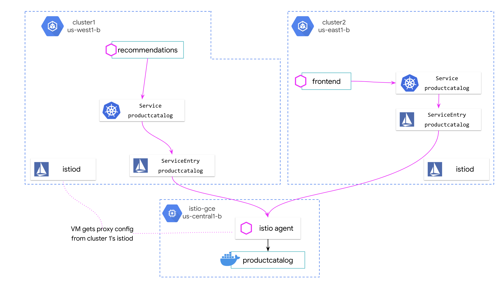
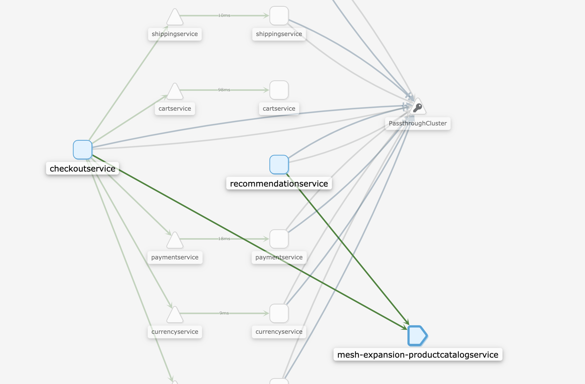
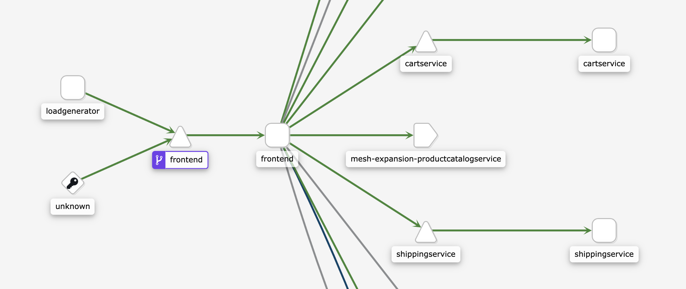
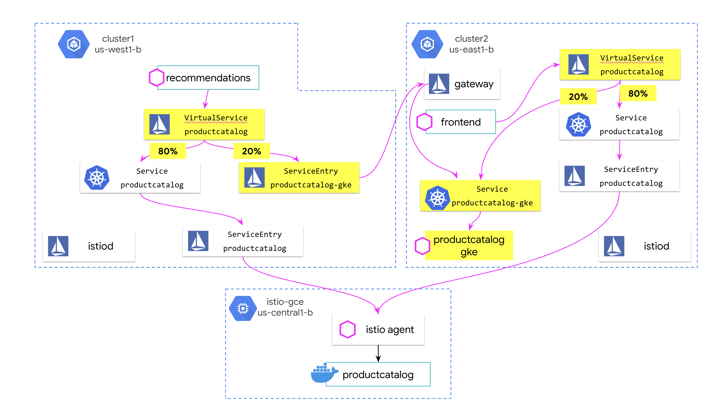
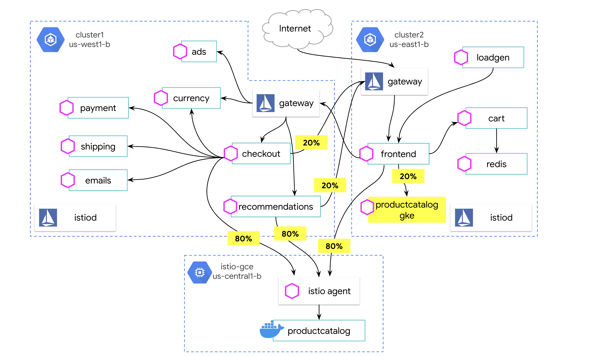
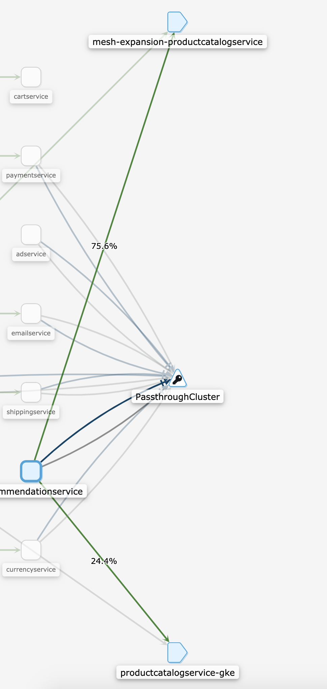
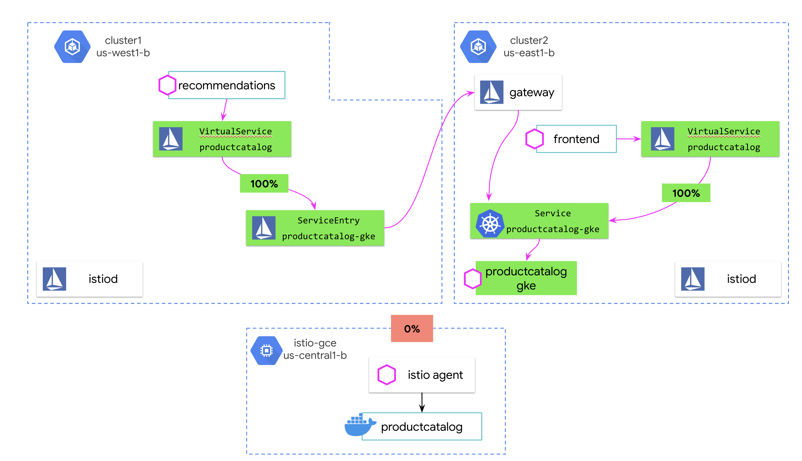
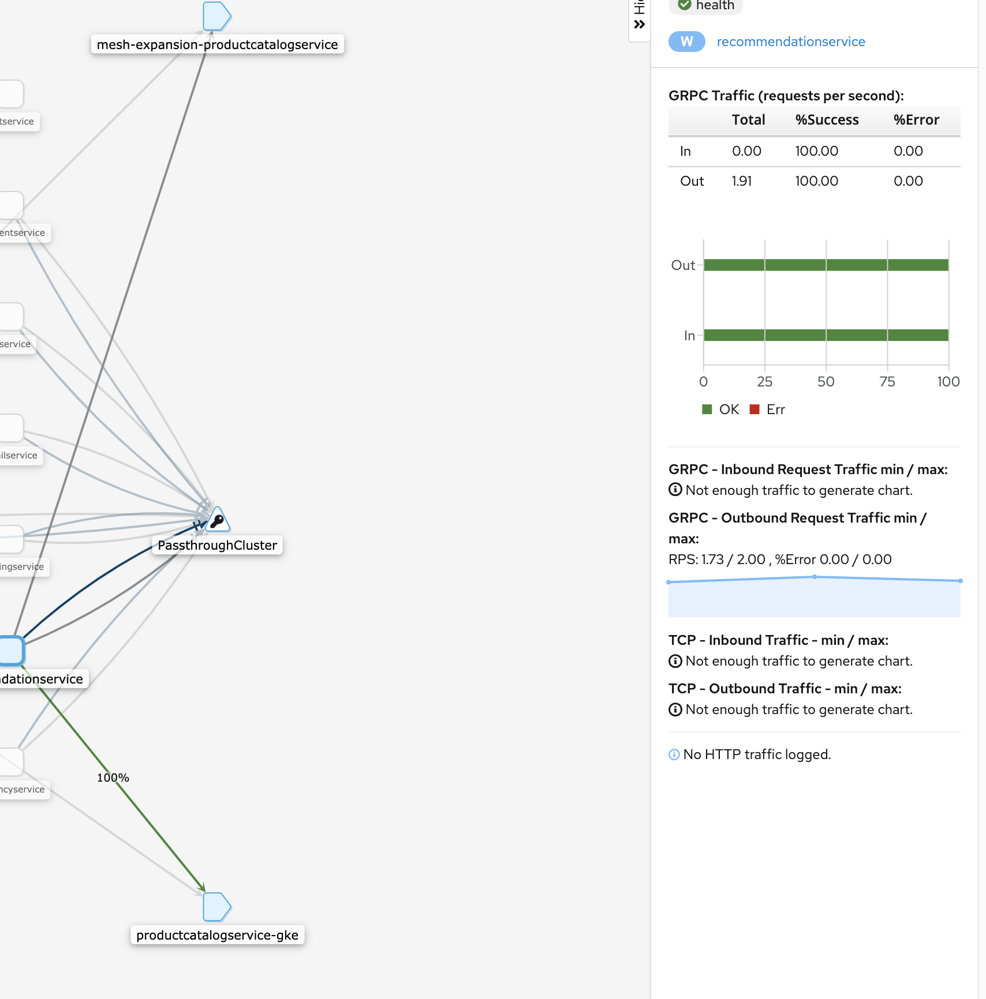

# Virtual Machine Migration with Multicluster Istio

  - [Introduction](#introduction)
  - [Setup](#setup)
  - [Deploy the sample application to GKE](#deploy-the-sample-application-to-gke)
  - [Install Istio on the VM](#install-istio-on-the-vm)
  - [Prepare for VM to GKE Migration](#prepare-for-vm-to-gke-migration)
  - [Migrate productcatalog to GKE](#migrate-productcatalog-to-gke)
  - [Complete the GKE Migration](#complete-the-gke-migration)
  - [Cleanup](#cleanup)

## Introduction

Istio works with services running in Kubernetes containers, but it also works with virtual machines. Because of this, Istio can help you integrate legacy VM workloads into a modern, Kubernetes-based service mesh - and help you migrate the VM services to Kubernetes, when you're ready.

For instance, let's say we want to deploy a multi-service application. This application consists mostly of Kubernetes-ready microservices (running across two cloud datacenters in `us-west` and `us-east`), but one of the older services (`productcatalog`) runs in a virtual machine in `us-central`. We can still get all the benefits of Istio (telemetry, security, traffic policies) for that virtual machine service. Then, when we're ready to migrate `productcatalog` from a VM to a container running in one of our Kubernetes clusters, Istio can progressively - and safely - migrate traffic from the VM to the container version with zero downtime.

In this sample, we will set up multicluster Istio on two GKE clusters, then configure a GCE instance to join the mesh. Then we'll deploy a sample app across the two clusters and the VM. Finally, we'll deploy the VM service a Kubernetes pod alongside the VM instance, and use Istio traffic splitting to migrate from GCE to all GKE. We will work towards this final state, where the VM service is no longer needed -


## Setup

1. Set your project ID.
```
export PROJECT_ID="<your-project-id>"
```

2. Run the first script to create two GKE clusters and one GCE instance in your project.

```
./scripts/1-create-infra.sh
```

3. Wait for the clusters to be `RUNNING`.

```
watch gcloud container clusters list

NAME      LOCATION    MASTER_VERSION  MASTER_IP      MACHINE_TYPE
NODE_VERSION    NUM_NODES  STATUS
cluster2  us-east1-b  1.14.10-gke.27  35.196.192.71  n1-standard-2
1.14.10-gke.27  4          RUNNING
cluster1  us-west1-b  1.14.10-gke.27  34.83.227.203  n1-standard-2
1.14.10-gke.27  4          RUNNING
```


4. Create firewall rules to allow traffic from the GKE pods in both clusters to your GCE instance. This will allow traffic to move freely between the two GKE clusters and the service running on the VM.

```
./scripts/2-firewall.sh
```


5. Install the Istio control plane on both GKE clusters. This script also connects the two Istio control planes into one logical mesh by updating the KubeDNS stubdomain - this is what will allow cross-cluster GKE mesh traffic to resolve to local Kubernetes services on the opposite cluster. [See the Istio docs](https://istio.io/docs/setup/install/multicluster/gateways/#setup-dns) for more information.

```
./scripts/3-install-istio-gke.sh
```


## Deploy the sample application to GKE

1. Deploy the OnlineBoutique sample application -- minus one backend service, `productcatalog` -- across the two GKE clusters. Note that until we deploy `productcatalog` onto the VM, the app will be in an error state and the loadgenerator pod will not start. This is expected because productcatalog is unreachable for now.

```
./scripts/4-deploy-onlineboutique-gke.sh
```

Note that this script creates Istio `ServiceEntry` resources so that services across clusters can access each other via the `IngressGateway` running in the opposite cluster. For example, in cluster 2, we create a `ServiceEntry` for `adservice` (running in cluster1) to that the frontend (in cluster2) can reach adservice in the opposite cluster via the Kubernetes DNS name `adservice.default.global`:


```YAML
# this service entry lives in cluster 2
apiVersion: networking.istio.io/v1alpha3
kind: ServiceEntry
metadata:
  name: adservice-entry
spec:
  addresses:
# this is a placeholder virtual IP, it's not used for routing
  - 240.0.0.2
  endpoints:
  # this is the istio ingressgateway IP for cluster 1 (the actual routing IP)
  - address: 35.230.67.174
    ports:
      grpc: 15443
  hosts:
# this is the address the frontend uses to reach adservice
  - adservice.default.global
# mesh internal means we own this service and it has a sidecar proxy
  location: MESH_INTERNAL
  ports:
  - name: grpc
# adservice serves grpc traffic on this port #
    number: 9555
    protocol: GRPC
  resolution: DNS
```

[See the Istio docs](https://istio.io/docs/setup/install/multicluster/gateways/#configure-the-example-services) for more details on how cross-cluster service discovery works.


## Install Istio on the VM

Now we're ready to install the Istio agent (sidecar proxy) on the GCE instance we provisioned earlier. This is the architecture we will set up:


1. Gather information about the Istio mesh running on GKE. This information is needed so that the Istio proxy on the VM can "call home" to a control plane, to receive proxy config, certs for mutual TLS, and know where to send metrics. Because we're running two Istio control planes, **we will configure the VM to "call home" to the Istio control plane running on cluster1.**

```
./scripts/5-prep-cluster1.sh
```

2. Install the Istio proxy on the VM, along with Docker. Then deploy `productcatalog` onto the VM as a raw Docker container. Note that you could use systemd or another deployment method to deploy your Istio-enabled service to the VM.

```
./scripts/6-prep-vm.sh
```


3. Add productcatalog to the logical mesh, via the `istioctl` tool. This command will create a `Service` and `ServiceEntry` for productcatalog running on the VM, to allow pods inside both clusters to reach `productcatalog` with a Kubernetes DNS name (`productcatalog.default.svc.cluster.local`), even though `productcatalog` isn't running in Kubernetes.

```
./scripts/7-add-vm-to-mesh.sh
```

The configuration across clusters now looks like this:




Note that we do this step for both clusters, because services on **both** cluster1 (recommendations, checkout) and cluster2 (frontend) must reach productcatalog on the VM.


4. Verify deployment. This script shows the pods running across both clusters, opens the Kiali service graph (for cluster1) in a browser tab, and outputs the Online frontend


```
./scripts/8-verify-deploy.sh
```

5. In a browser, navigate the IP shown at the end of the script output. You should see the OnlineBoutique frontend with a list of products - this shows that the frontend running on `cluster2` can reach both the services running on `cluster1` (eg. `currencyservice`) **and** the `productcatalog` service running on the VM, using the Kubernetes DNS names made possible by the Istio `ServiceEntry` resources we just created.


6. Open the Kiali service graph for cluster1. Log in with the demo credentials - `admin`/`admin`. You should see traffic going from two backend services -- `checkout` and `recommendations` to the ServiceEntry for `productcatalogservice`:



7. Open the Kiali service graph for cluster2. You should see traffic going from the frontend to `productcatalogservice` on the VM:



## Prepare for VM to GKE Migration

Now let's say we are ready to migrate `productcatalog` from GCE to one of our Istio-enabled GKE clusters. The first step to do this is to deploy `productcatalog` as a GKE pod, alongside the VM. To start, we will continue sending all traffic to the VM.

1. Deploy `productcatalog-gke` to cluster2, but don't send any traffic there yet. This script creates the Kubernetes and Istio resources to set up the VM-to-GKE migration - `Deployment` (cluster2), `Service` (cluster2), `ServiceEntry` (cluster1), and `VirtualService` (both clusters).

```
./scripts/9-deploy-productcatalog-gke.sh
```

Note the way we're "wrapping" a single VirtualService around two Kubernetes hostnames. This is what will let us split traffic across the GKE and VM versions of `productcatalog` in the next step. Here, `productcatalogservice` is the VM `ServiceEntry` already created on both clusters. `productcatalogservice-gke` is a separate Kubernetes service. For cluster2, `productcatalogservice-gke` is a **local** `Service`:

```YAML
apiVersion: networking.istio.io/v1alpha3
kind: VirtualService
metadata:
  name: productcatalog-migration
spec:
  hosts:
    - productcatalogservice
  http:
  - route:
    - destination:
        host: productcatalogservice
      weight: 0
    - destination:
        host: productcatalogservice-gke
      weight: 100
```

For cluster1, productcatalog's hostname corresponds to an Istio ServiceEntry.

```YAML
apiVersion: networking.istio.io/v1alpha3
kind: VirtualService
metadata:
  name: productcatalog-migration
spec:
  hosts:
    - productcatalogservice
  http:
  - route:
    - destination:
        host: productcatalogservice
      weight: 0
    - destination:
        host: productcatalogservice-gke.default.global
      weight: 100
```

## Migrate productcatalog to GKE

1. Update the two VirtualServices to send 20% of productcatalog traffic to the GKE pod running in `cluster2`, and send the remaining 80% of traffic to the VM.

```
./scripts/10-split-traffic.sh
```

Our Istio configuration now looks like this:




And the traffic split looks like this:



2. Return to the Kiali service graph to view the traffic splitting in action:



## Complete the GKE Migration

In a real production migration, you would continue updating the traffic percentages to slowly send more traffic to the GKE version of `productcatalog.`. Let's say we've done that and we're ready to send 100% of traffic to the GKE pod.

1. Complete the migration by updating both VirtualServices to send 100% of productcatalog traffic to the GKE pod, and 0% of traffic to the VM.

```
./scripts/11-complete-migration.sh
```

Our Istio config is now:



To create the final traffic state where all traffic is now within GKE:


You should also see in Kiali (cluster1 shown here) that 100% of productcatalog traffic is going to the GKE version:



The VM migration is complete! Now it would be safe to retire the VM, since all the app services are now running across our two GKE clusters.


## Cleanup

To clean up the resources (GKE clusters, VM) used in this tutorial:

```
./scripts/12-cleanup.sh
```