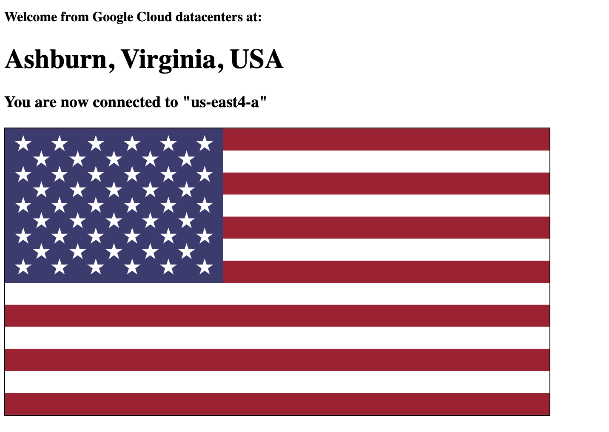

# Configuring Multicluster Istio Ingress with a Geo-aware Google Load Balancer


```
➜  multicluster-ingress git:(master) ✗ kubemci list
NAME                  IP             CLUSTERS
zoneprinter-ingress   34.102.158.9   cluster1, cluster2, cluster3
```


`kubemci get-status zoneprinter-ingress --gcp-project=${PROJECT_ID}`


```
➜  multicluster-ingress git:(master) ✗ kubemci get-status zoneprinter-ingress --gcp-project=${PROJECT_ID}
Load balancer zoneprinter-ingress has IPAddress 34.102.158.9 and is spread across 3 clusters (cluster1,cluster2,cluster3)
```


### Test geo-aware load balancing

From my laptop, connected to my home network on the East Coast, if I enter the global IP in a browser, I see that I'm routed to the `us-east4-a` cluster:




Refreshing the page, I continue to see the us-east Zone Printer instance.

I can then create GCE instances in different regions, and watch them get routed to the closest Istio cluster. For instance, an instance in the Netherlands (`europe-west4-a`) is routed to the London (`europe-west2-b`) cluster:

```
mokeefe@netherlands-client:~$ curl 34.102.158.9
<!DOCTYPE html>
                <h4>Welcome from Google Cloud datacenters at:</h4>
                <h1>London, U.K.</h1>
                <h3>You are now connected to &quot;europe-west2-b&quot;</h3>
                
```

And an instance in Oregon (`us-west1-b`) is routed to the Los Angeles (`us-west2-a`) cluster:

```
mokeefe@oregon-client:~$  curl 34.102.158.9
<!DOCTYPE html>
                <h4>Welcome from Google Cloud datacenters at:<h4>
                <h1>us-west2-a!</h1>
```