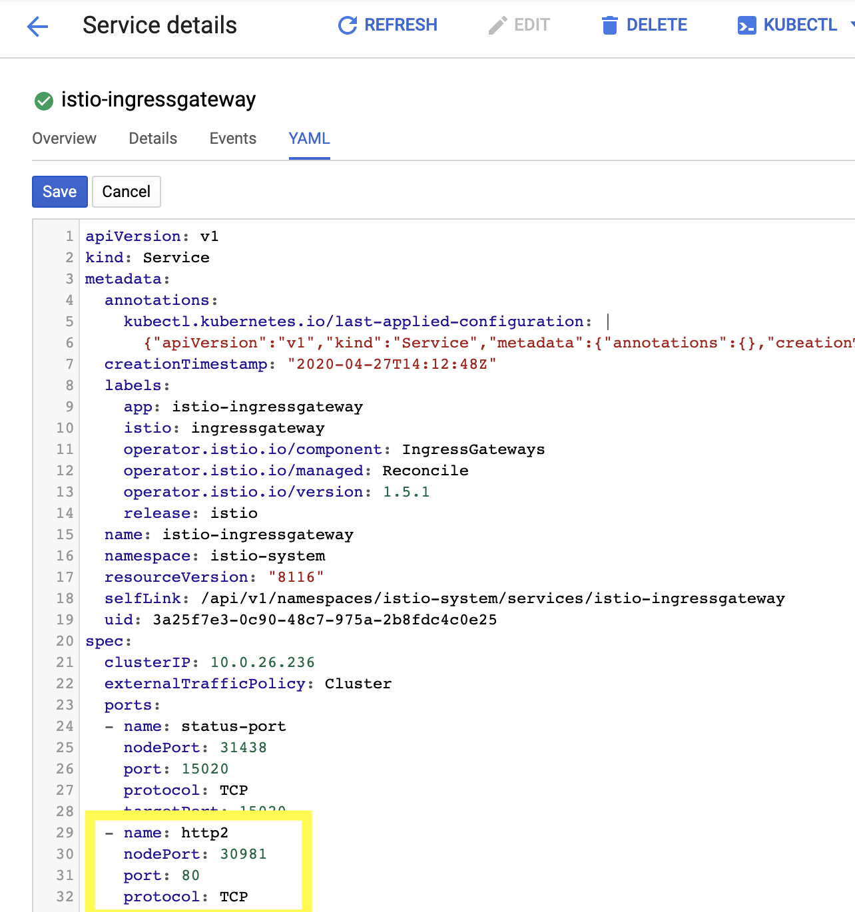
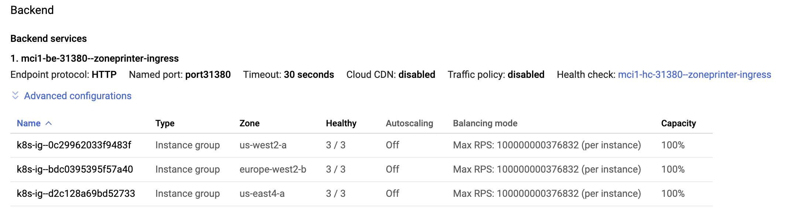

# Geo-Aware Istio Multicluster Ingress
- [Geo-Aware Istio Multicluster Ingress](#geo-aware-istio-multicluster-ingress)
  - [Introduction](#introduction)
  - [Prerequistes](#prerequistes)
  - [Setup](#setup)
  - [Install Istio](#install-istio)
  - [Deploy the Sample App](#deploy-the-sample-app)
  - [Configure Multicluster Ingress](#configure-multicluster-ingress)
  - [Standardize NodePort numbers](#standardize-nodeport-numbers)
  - [Create multicluster ingress](#create-multicluster-ingress)
  - [Verify Multicluster Ingress](#verify-multicluster-ingress)
  - [Test Geo-Aware Load Balancing](#test-geo-aware-load-balancing)
  - [Cleanup](#cleanup)
  - [Learn More](#learn-more)


## Introduction

Managing Kubernetes Ingress traffic is an essential use case. If you are running the same services across multiple GKE clusters/regions, [you can use a GCP HTTP(S) Load Balancer](https://cloud.google.com/kubernetes-engine/docs/how-to/multi-cluster-ingress), configured with a global anycast IP, combined with Ingress resources for your services, to route client traffic to the closest GKE cluster.

But what if you've installed Istio on your clusters, and want to leverage the policy logic of [Istio `Gateways`](https://istio.io/docs/tasks/traffic-management/ingress/ingress-control/), and at the same time, enable multicluster load balancing? This sample demonstrates how to use the [`kubemci`](https://github.com/GoogleCloudPlatform/k8s-multicluster-ingress) tool to map a global Anycast IP to multiple Istio IngressGateways, running in three separate clusters/regions. In the end, we will show how to route client requests to the closest instance of a service, which is replicated across three clusters.


## Prerequistes

- One [GCP Project](https://cloud.google.com/resource-manager/docs/creating-managing-projects) with Billing enabled
- [GCE, Container APIs enabled](https://cloud.google.com/apis/docs/getting-started#enabling_apis)
- [gcloud](https://cloud.google.com/sdk/install) SDK
- [kubectl](https://kubernetes.io/docs/tasks/tools/install-kubectl/)

## Setup

First, set your project ID:

```
export PROJECT_ID="<your-project-id>"
```

Ensure gcloud is authenticated to your account:

```
gcloud auth login
gcloud auth application-default login
```

Then, run the following script to create three GKE clusters in the `us-east`, `us-west`, and `europe-west` regions:

```
./1-create-clusters.sh
```

Wait for all three clusters to be `RUNNING`:

```
watch gcloud container clusters list
```

After a few minutes, you should see:

```

NAME      LOCATION        MASTER_VERSION  MASTER_IP      MACHINE_TYPE   NODE_VERS
ION   NUM_NODES  STATUS
cluster3  europe-west2-b  1.14.8-gke.12   <IP>  n1-standard-4  1.14.8-gke.12  3          RUNNING
cluster2  us-east4-a      1.14.8-gke.12   <IP>  n1-standard-4  1.14.8-gke.12  3          RUNNING
cluster1  us-west2-a      1.14.8-gke.12   <IP>  n1-standard-4  1.14.8-gke.12  3          RUNNING
```

## Install Istio

Install the Istio control plane on all three clusters. *Note* - this script may take 5-10 minutes to complete.

```
./2-install-istio.sh
```

## Deploy the Sample App

Deploy the [Zone Printer](https://github.com/GoogleCloudPlatform/k8s-multicluster-ingress/tree/ef552c26e53be19e39f0762c675ced21c3ce08ef/examples/zone-printer) sample application on all three clusters. This application is a simple web server that prints the GKE Region/Zone it's running in.

```
./3-deploy-app.sh
```

This script creates four resources:
1. A Kubernetes Deployment, `zone-printer`
2. A Kubernetes Service, `zone-printer` (type `ClusterIP`), mapping to the `zone-printer` Deployment
3. An Istio Gateway, punching port `80` into the default IngressGateway
4. An Istio `VirtualService` to route inbound requests through the Gateway, to the `zone-printer` Service on port `80`.

Note that right now (and by default), the Istio IngressGateway is mapped to a service type `LoadBalancer`, and has its own separate public IP. We can separately call that IngressGateway IP on all three clusters to verify that the zone printer app is running:

```
./4-verify-app.sh
```

You should see HTML output for each cluster, including reports from three separate regions:

```
    <h1>us-west2-a!</h1>
...
    <h1>Ashburn, Virginia, USA</h1>
...
    <h1>London, U.K.</h1>
```

## Configure Multicluster Ingress

Now we're ready to put a global IP in front of all threy Istio IngressGateways, to enable geo-aware anycast routing.

```
./5-prep-mci.sh
```

This script does the following:
1. Creates a VirtualService on all three clusters, to set up health checking for the IngressGateway. [This is needed](https://cloud.google.com/kubernetes-engine/docs/concepts/ingress#health_checks) for GCP load balancer health checking. Because the IngressGateway already exposes a `/healthz` endpoint on port `15020`, we just have to do a URL rewrite for requests from the `GoogleHC` user-agent.
2. Updates the Service type on the Istio IngressGateway on all three clusters, from `LoadBalancer` to `NodePort`. A NodePort service is needed to configure Ingress.

## Standardize NodePort numbers

kubemci requires that all the NodePorts used for the multicluster ingress be the same. Navigate to Cloud Console > Kubernetes Engine > Services & Ingress, and for the service `istio-ingressgateway` on all three services, click "Edit" and update the `http2` nodeport to be `30981`:



## Create multicluster ingress

```
./6-mci.sh
```

This script does the following:
1. Reserves a global static IP in your project, named `zoneprinter-ip`.
2. Installs [`kubemci`](https://github.com/GoogleCloudPlatform/k8s-multicluster-ingress), then uses it to provision a multicluster Ingress, mapping to the three clusters. The `kubemci create` command takes in the following Kubernetes Ingress resource (see `manifests/ingress.yaml`):


```YAML
apiVersion: extensions/v1beta1
kind: Ingress
metadata:
  name: ingress-zoneprinter
  namespace: istio-system
  annotations:
    kubernetes.io/ingress.global-static-ip-name: zoneprinter-ip
    kubernetes.io/ingress.class: gce-multi-cluster
spec:
  backend:
    serviceName: istio-ingressgateway
    servicePort: 80
```

Here, we're creating an `Ingress` for our existing NodePort backend service, `istio-ingressgateway`. We add the name of the global static IP we reserved, and a multicluster `ingress.class` which tells the kubemci tool to configure Ingress resources on all three clusters in our Kubeconfig. From here, the `kubemci` tool provisions a GCP HTTP(S) Load Balancer, including backend services, url mappings, and firewall rules.

Two notes about this process:
1. This is exactly how you'd do multicluster ingress for a single service, representing *one* backend workload (one Kubernetes Service) - the difference is that here, we're instead setting up ingress to an intermediate IngressGateway, allowing us to configure Istio traffic rules for *many* backend workloads, each srepresented by its own Kubernetes Service.
2. Any multicluster ingress setup assumes that the same workloads (and in this case, traffic rules). We recommend using a Continuous Deployment tool to ensure that all clusters have ths same set of resources.


## Verify Multicluster Ingress

Verify that the multicluster ingress was created, by running `./kubemci list`. You should see:

```
NAME                  IP             CLUSTERS
zoneprinter-ingress   <your-global-IP>   cluster1, cluster2, cluster3
```

Then, run:

```
./kubemci get-status zoneprinter-ingress --gcp-project=${PROJECT_ID}
```

You should see:
```
Load balancer zoneprinter-ingress has IPAddress <ip> and is spread across 3 clusters (cluster1,cluster2,cluster3)
```

But how does this multi-cluster `zoneprinter-ingress` load balancer translate into individual cluster resources? From `cluster3`, run:

```
kubectl get ingress ingress-zoneprinter -n istio-system -o yaml
```

You should see:

```YAML
apiVersion: extensions/v1beta1
kind: Ingress
metadata:
  annotations:
    ingress.gcp.kubernetes.io/instance-groups: '[{"Name":"k8s-ig--eab086beeb92f4d7","Zone":"https://www.googleapis.com/compute/v1/projects/istio-multicluster-ingress/zones/europe-west2-b"}]'
    kubernetes.io/ingress.class: gce-multi-cluster
    kubernetes.io/ingress.global-static-ip-name: zoneprinter-ip
...
```

Here, each cluster is its own [instance group](https://cloud.google.com/load-balancing/docs/backend-service#backends) (a managed GKE cluster). If you navigate in the Cloud Console to Network Services > Load Balancing, and click on the load balancer beginning with `mci...`, you should see:




## Test Geo-Aware Load Balancing

Now that we've configure multicluster ingress for a global anycast IP, we should be able to access the global IP from clients around the world, and be routed to the ZonePrinter running in the closest GKE cluster. **Note**: it may take about 5 minutes to provision the load balancer.

For instance, from a laptop connected to a network on the East Coast, we're redirected to the `us-east4` cluster:

```
mokeefe@laptop:~$ curl  34.102.158.9
<!DOCTYPE html>
		<h4>Welcome from Google Cloud datacenters at:</h4>
		<h1>Ashburn, Virginia, USA</h1>
		<h3>You are now connected to &quot;us-east4-a&quot;</h3>
		
```

To test the geo-aware routing further, you can [create Google Compute Engine instances](https://cloud.google.com/compute/docs/instances/create-start-instance) in different regions, ssh into each one, and `curl` the global IP. For instance, a VM in the Netherlands (`europe-west4-a`) is routed to the London (`europe-west2-b`) cluster:

```
mokeefe@netherlands-client:~$ curl 34.102.158.9
<!DOCTYPE html>
                <h4>Welcome from Google Cloud datacenters at:</h4>
                <h1>London, U.K.</h1>
                <h3>You are now connected to &quot;europe-west2-b&quot;</h3>
                
```

And a VM in Oregon (`us-west1-b`) is routed to the Los Angeles (`us-west2-a`) cluster:

```
mokeefe@oregon-client:~$  curl 34.102.158.9
<!DOCTYPE html>
                <h4>Welcome from Google Cloud datacenters at:<h4>
                <h1>us-west2-a!</h1>
```

🎊 Well done! You just set up geo-aware load balancing for Istio services running across three regions.

## Cleanup

To delete the resources used in this sample (ingress, static IP, GKE clusters):

```
./7-cleanup.sh
```

## Learn More

- [Istio By Example - Ingress (Single Cluster)](https://istiobyexample.dev/ingress/)
- [Istio Docs - Ingress Gateway](https://istio.io/docs/concepts/traffic-management/#gateways)
- [Solution: Integrating HTTP(S) Load Balancing with Istio and Cloud Run for Anthos on Google Cloud](https://cloud.google.com/solutions/integrating-https-load-balancing-with-istio-and-cloud-run-for-anthos-deployed-on-gke#top_of_page)