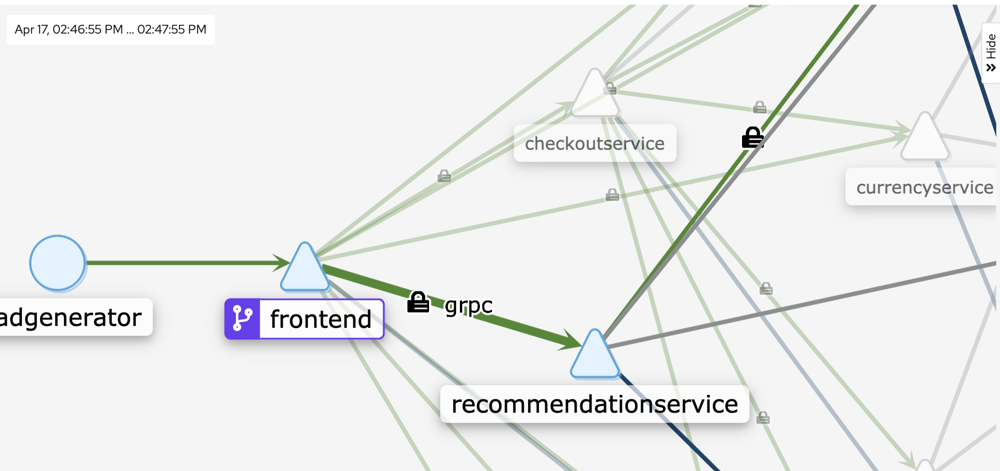

# Demo: Introduction to Istio Security

This example demonstrates how to leverage [Istio's](https://istio.io/docs/concepts/security/) **identity** and **access control** policies to help secure microservices running on [GKE](https://cloud.google.com/kubernetes-engine/).

We'll use the [Hipstershop](https://github.com/GoogleCloudPlatform/microservices-demo) sample application to cover:

*   Incrementally adopting Istio **strict mutual TLS** authentication across the service mesh
*   Enabling **JWT** authentication for the frontend service
*   Using an Istio **authorization policy** to secure access to the frontend service

### Contents

  - [Setup](#setup)
    - [Create a GKE Cluster](#create-a-gke-cluster)
    - [Deploy the Sample Application](#deploy-the-sample-application)
  - [Authentication](#authentication)
    - [Enable mTLS for the frontend service](#enable-mtls-for-the-frontend-service)
    - [Enable mTLS for the default namespace](#enable-mtls-for-the-default-namespace)
    - [Add End-User JWT Authentication](#add-end-user-jwt-authentication)
  - [Authorization](#authorization)
    - [Enable authorization (RBAC) for the frontend](#enable-authorization-(rbac)-for-the-frontend)
    - [Control access to the frontend](#control-access-to-the-frontend)
  - [Cleanup](#cleanup)
  - [What's next?](#whats-next)

## Setup

[Google Cloud Shell](https://cloud.google.com/shell/docs/) is a browser-based terminal that Google provides to interact with your GCP resources. It is backed by a free Compute Engine instance that comes with many useful tools already installed, including everything required to run this demo.

Click the button below to open the demo instructions in your Cloud Shell:

[](https://console.cloud.google.com/cloudshell/open?git_repo=https%3A%2F%2Fgithub.com%2FGoogleCloudPlatform%2Fistio-samples&page=editor&tutorial=security-intro/README.md)

1. Change into the demo directory.

```
cd security-intro
```

### Create a GKE Cluster

1. From Cloud Shell, **enable the Kubernetes Engine API**.

```
gcloud services enable container.googleapis.com
```

2. **Create a GKE cluster**.

```
gcloud beta container clusters create istio-security-demo \
    --zone=us-central1-f \
    --machine-type=n1-standard-2 \
    --num-nodes=4
```

3. **Install Istio** on the cluster.

```
cd common/
./install_istio.sh
```

4. Wait for all Istio pods to be `Running` or `Completed`.
```
kubectl get pods -n istio-system
```

### Deploy the sample application

We will use the [Hipstershop](https://github.com/GoogleCloudPlatform/microservices-demo) sample application for this demo.

1. **Apply the sample app manifests**

```
kubectl apply -f https://raw.githubusercontent.com/GoogleCloudPlatform/microservices-demo/master/release/kubernetes-manifests.yaml
kubectl apply -f https://raw.githubusercontent.com/GoogleCloudPlatform/microservices-demo/master/release/istio-manifests.yaml
```


2. Run `kubectl get pods -n default` to ensure that all pods are `Running` and `Ready`.

```
NAME                                     READY     STATUS    RESTARTS   AGE
adservice-76b5c7bd6b-zsqb8               2/2       Running   0          1m
checkoutservice-86f5c7679c-8ghs8         2/2       Running   0          1m
currencyservice-5749fd7c6d-lv6hj         2/2       Running   0          1m
emailservice-6674bf75c5-qtnd8            2/2       Running   0          1m
frontend-56fdfb866c-tvdm6                2/2       Running   0          1m
loadgenerator-b64fcb8bc-m6nd2            2/2       Running   0          1m
paymentservice-67c6696c54-tgnc5          2/2       Running   0          1m
productcatalogservice-76c6454c57-9zj2v   2/2       Running   0          1m
recommendationservice-78c7676bfb-xqtp6   2/2       Running   0          1m
shippingservice-7bc4bc75bb-kzfrb         2/2       Running   0          1m
```

🔎 Each pod has 2 containers, because each pod now has the injected Istio
sidecar proxy.

Now we're ready to enforce security policies for this application.

## Authentication

[**Authentication**](https://istio.io/docs/concepts/security/#authentication) refers to identity: who is this service? who is this end-user? and can I trust that they are who they say they are?

One benefit of using Istio that it provides **uniformity** for both service-to-service and end
user-to-service authentication. Istio **abstracts** away authentication from
your application code, by [tunneling](https://istio.io/docs/concepts/security/#mutual-tls-authentication) all service-to-service communication through the Envoy
sidecar proxies. And by using a **centralized** [Public-Key
Infrastructure](https://istio.io/docs/concepts/security/#pki), Istio provides **consistency** to make sure authentication is set up
properly across your mesh. Further, Istio allows you to adopt mTLS on a per-service basis,
or **easily toggle end-to-end encryption** for your entire
mesh. Let's see how.

### Explore default mTLS behavior.

Starting in Istio 1.5, the [default Istio mTLS behavior](https://istio.io/docs/tasks/security/authentication/authn-policy/#auto-mutual-tls) is "auto." This means that pod-to-pod traffic will use mutual TLS by default, but pods will still accept plain-text traffic - for instance, from pods in a different namespace that are not injected with the Istio proxy.
Because we deployed the entire sample app into one namespace (`default`) and all pods have the Istio sidecar proxy, traffic will be mTLS for all the sample app workloads. Let's look at this behavior.

1. Open the Kiali service graph in a web browser.

```
istioctl dashboard kiali &
```

2. In the left sidecar, click Graph > Namespace: `default`. Under "display," click the `security` view. You should see a lock icon on the edges in the graph, indicating that traffic is encrypted/mTLS.



### Enforce strict mTLS for the frontend service

From this default "permissive" mTLS behavior, we can enforce "strict" mTLS for a workload, namespace, or for the entire mesh. This means that only mTLS traffic will be accepted by the target workload(s).

Let's enforce strict mTLS for the frontend workload. We'll use an Istio [`PeerAuthentication`](https://istio.io/docs/reference/config/security/peer_authentication/) resource to do this.

1. To start, see what happens by default when you try to curl the frontend service with plain HTTP, from another pod in the same namespace. Your request should succeed with status `200`, because by default, both TLS and plain text traffic is accepted.

```
$ kubectl exec $(kubectl get pod -l app=productcatalogservice -o jsonpath={.items..metadata.name}) -c istio-proxy -- curl http://frontend:80/ -o /dev/null -s -w '%{http_code}\n'

200
```

2. Open the mTLS policy in `./manifests/mtls-frontend.yaml`. Notice how the authentication policy uses labels and selectors to target the specific `frontend` deployment in the `default` namespace.

```
apiVersion: "security.istio.io/v1beta1"
kind: "PeerAuthentication"
metadata:
  name: "frontend"
  namespace: "default"
spec:
  selector:
    matchLabels:
      app: frontend
  mtls:
    mode: STRICT
```

3. Apply the policy.

```
kubectl apply -f ./manifests/mtls-frontend.yaml
```

4. Try to reach the frontend again, with a plain HTTP request from the istio-proxy container in productcatalog.

```
kubectl exec $(kubectl get pod -l app=productcatalogservice -o jsonpath={.items..metadata.name}) -c istio-proxy -- curl http://frontend:80/ -o /dev/null -s -w '%{http_code}\n'
```

You should see:

```
000
command terminated with exit code 56
```

Exit code `56` [means](https://curl.haxx.se/libcurl/c/libcurl-errors.html) "failure to
receive network data." This is expected because now, the frontend expects TLS certificates on every request.

### Enable mTLS for the default namespace

Now that we've adopted mTLS for one service, let's enforce mTLS for the [entire
`default`
namespace](https://istio.io/docs/tasks/security/authn-policy/#namespace-wide-policy).

1. **Open** `manifests/mtls-default-ns.yaml`. Notice that we're using the same resource type (`PeerAuthentication`) as we used for the workload-specific policy. The difference is that we omit `selectors` for a specific service, and only specify the `namespace` on which we want to enforce mTLS.

```
apiVersion: "security.istio.io/v1beta1"
kind: "PeerAuthentication"
metadata:
  name: "default"
  namespace: "default"
spec:
  mtls:
    mode: STRICT
```

2. **Apply** the resource:

```
kubectl apply -f ./manifests/mtls-default-ns.yaml
```

3. Clean up by deleting the policies created in this section.

```
kubectl delete -f ./manifests/mtls-frontend.yaml
kubectl delete -f ./manifests/mtls-default-ns.yaml
```

### Add End-User JWT Authentication

Now that we've enabled service-to-service authentication in the default namespace, let's
enforce **end-user ("origin") authentication** for the `frontend` service, using [JSON Web Tokens](https://jwt.io/)
(JWT).

First, we'll create an Istio policy to [enforce JWT authentication](https://istio.io/docs/tasks/security/authorization/authz-jwt/) for inbound requests
to the `frontend` service.

1. **Open** the policy in  `./manifests/jwt-frontend-request.yaml`. The Istio policy we'll use is called a [`RequestAuthentication`](https://istio.io/docs/reference/config/security/request_authentication/) resource.

```
apiVersion: security.istio.io/v1beta1
kind: RequestAuthentication
metadata:
 name: frontend
 namespace: default
spec:
  selector:
    matchLabels:
      app: frontend
  jwtRules:
  - issuer: "testing@secure.istio.io"
    jwksUri: "https://raw.githubusercontent.com/istio/istio/release-1.5/security/tools/jwt/samples/jwks.json"
```

🔎 This policy uses Istio's
test JSON Web Key Set (`jwksUri`), the public key used to validate incoming JWTs.


2. **Apply** the `RequestAuthentication` resource.

```
kubectl apply -f ./manifests/jwt-frontend-request.yaml
```

3. **Set a local `TOKEN` variable.** We'll use this token on the client-side
   to make requests to the frontend.

```
TOKEN=$(curl -k https://raw.githubusercontent.com/istio/istio/release-1.4/security/tools/jwt/samples/demo.jwt -s); echo $TOKEN
```

4. Curl the frontend with a valid JWT.

```
kubectl exec $(kubectl get pod -l app=productcatalogservice -o jsonpath={.items..metadata.name}) -c istio-proxy \
-- curl  http://frontend:80/ -o /dev/null --header "Authorization: Bearer $TOKEN" -s -w '%{http_code}\n'
```

5. Now, try to reach the frontend **without** a JWT.

```
kubectl exec $(kubectl get pod -l app=productcatalogservice -o jsonpath={.items..metadata.name}) -c istio-proxy \
-- curl  http://frontend:80/ -o /dev/null -s -w '%{http_code}\n'

200
```

You should see a `200` code. Why is this? Because starting in Istio 1.5, the Istio `RequestAuthentication` (JWT) policy [is only responsible for *validating*](https://istio.io/docs/tasks/security/authorization/authz-jwt/#allow-requests-with-valid-jwt-and-list-typed-claims) tokens. If we pass an invalid token, we should see a "401: Unauthorized" response:

```
kubectl exec $(kubectl get pod -l app=productcatalogservice -o jsonpath={.items..metadata.name}) -c istio-proxy \
-- curl  http://frontend:80/ -o /dev/null --header "Authorization: Bearer helloworld" -s -w '%{http_code}\n'

401
```

But if we pass no token at all, the `RequestAuthentication` policy is not invoked. Therefore, in addition to this authentication policy, we need an **authorization policy** that requires a JWT on all requests.

6. View the `AuthorizationPolicy` resource - open `manifests/jwt-frontend-authz.yaml`. This policy declares that all requests to the `frontend` workload must have a JWT.

```
apiVersion: security.istio.io/v1beta1
kind: AuthorizationPolicy
metadata:
  name: require-jwt
  namespace: default
spec:
  selector:
    matchLabels:
      app: frontend
  action: ALLOW
  rules:
  - from:
    - source:
       requestPrincipals: ["testing@secure.istio.io/testing@secure.istio.io"]
```

7. Apply the `AuthorizationPolicy`.

```
kubectl apply -f manifests/jwt-frontend-authz.yaml
```


8. Curl the frontend again, without a JWT. You should now see `403 - Forbidden`. This is the `AuthorizationPolicy` taking effect-- that all frontend requests must have a JWT.

```
kubectl exec $(kubectl get pod -l app=productcatalogservice -o jsonpath={.items..metadata.name}) -c istio-proxy \
-- curl  http://frontend:80/ -o /dev/null -s -w '%{http_code}\n'
```


✅ You should see a `200` response code.

🎉 Well done! You just secured the `frontend` service with a JWT policy and an authorization policy.

9. Clean up:

```
kubectl delete -f manifests/jwt-frontend-authz.yaml
kubectl delete -f manifests/jwt-frontend-request.yaml
```

## Authorization

We just saw a preview of how to enforce access control using Istio `AuthorizationPolicies`. Let's go deeper into how these policies work.

Unlike authentication, which refers to the "who," **authorization** refers to the "what", or: what is this service or user allowed to do?

By default, requests between Istio services (and between end-users and services) are [allowed by default](https://istio.io/docs/concepts/security/#implicit-enablement). You can then enforce authorization for one or many services using an [`AuthorizationPolicy`](https://istio.io/docs/reference/config/security/authorization-policy/) custom resource.

Let's put this into action, by only allowing requests to the `frontend` that have a specific HTTP header (`hello`:`world`):

```
apiVersion: "security.istio.io/v1beta1"
kind: "AuthorizationPolicy"
metadata:
  name: "frontend"
  namespace: default
spec:
  selector:
    matchLabels:
      app: frontend
  rules:
  - when:
    - key: request.headers[hello]
      values: ["world"]
```

1. **Apply the AuthorizationPolicy** for the frontend service:

```
kubectl apply -f ./manifests/authz-frontend.yaml
```

2. Curl the frontend without the `hello` header. You should see a `403: Forbidden` response.

```
kubectl exec $(kubectl get pod -l app=productcatalogservice -o jsonpath={.items..metadata.name}) -c istio-proxy \
-- curl http://frontend:80/ -o /dev/null -s -w '%{http_code}\n'

403
```

3. Curl the frontend with the `hello`:`world` header. You should now see a `200` response code.

```
kubectl exec $(kubectl get pod -l app=productcatalogservice -o jsonpath={.items..metadata.name}) -c istio-proxy \
-- curl --header "hello:world" http://frontend:80 -o /dev/null -s -w '%{http_code}\n'

200
```

✅ You just configured a fine-grained Istio access control policy for one
service. We hope this section demonstrated how Istio can support specific, service-level
authorization policies using a set of familiar, Kubernetes-based resources.

## Cleanup

To avoid incurring additional costs, delete the GKE cluster created in this demo:

```
gcloud container clusters delete istio-security-demo --zone=us-central1-f
```

Or, to keep your GKE cluster with Istio and Hipstershop still installed, delete the Istio security
resources only:

```
kubectl delete -f ./manifests
```

## What's next?

If you're interested in learning more about Istio's security features, read more at:

*   [Concepts: Istio Security](https://istio.io/docs/concepts/security/)
*   [Task: Authentication Policy / Precedence](https://istio.io/docs/tasks/security/authn-policy/#policy-precedence)
*   [Task: Mutual TLS Migration](https://istio.io/docs/tasks/security/mtls-migration/)
*   [Task: Securing Gateways with HTTPS](https://istio.io/docs/tasks/traffic-management/secure-ingress/)
*   [Task: Mutual TLS Over HTTPS](https://istio.io/docs/tasks/security/https-overlay/)
*   [Example: TLS Origination for Egress Traffic ](https://istio.io/docs/examples/advanced-egress/egress-tls-origination/)
